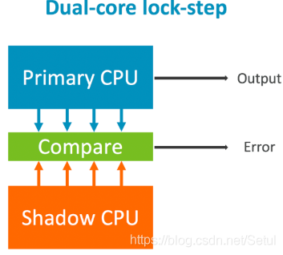
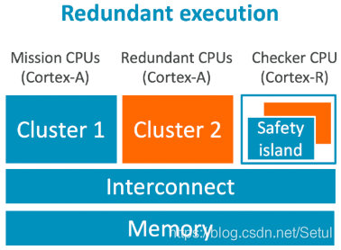

# 锁步核（lock-step）-软件冗余-可分核（split-step）

>为了满足汽车功能安全（如ISO26262），有许多有用的措施来规避E/E系统异常崩溃造成的不必要伤害。

## 1. lock-step core(锁步核)

锁步核是实现高诊断覆盖度（检测错误发生的能力）的一种传统方法。实现方法是：两个核运行同样的程序，将结果输入一个比较逻辑中，周期性比较两个核的输出结果是否相同。如果相同，则继续运行；否则，则需要采取一定的措施。如果一段时间后错误还是存在，可能重启或者重新检查。锁步核的设计是固定在芯片设计中的，所以没有可调整性。容易看出，锁步核虽然用了两个核，但其实只起到一个核的作用。这种方法已经在微控制器和复杂度较低的微处理器领域经过多年的成功验证。

## 2. Redundant execution(冗余执行)

对于高性能处理器来说往往复杂度高、不确定性大，实现lock-step很难。软件冗余执行就是一种可选方案。
假设两个独立应用执行在两个不同的CPU和或者是两个虚拟机上，这两个应用的结果输出到一个被称为“safety island” 的核中，由这个核负责决策和执行。这个核使用单独的时钟和电源，且有很高的安全性能。这种方案提升了系统复杂度，但是软件执行更加灵活。lock-step的比较机制是固化在芯片中的，而“safety island” 是一个单独的核。
这个方案在需要高安全性和高性能的场景可能会得到广泛应用。

## 3. Split-Lock(可分核)

以上两种方案可有优劣，ARM在 Cortex-A76AE上集成了一种叫 ‘Split-Lock’的技术来集成上述两种方案的优点。‘Split-Lock’可以被配置成两种模式：‘split mode’，两个CPU可以独立执行不同的程序或任务； ‘lock mode’ ，两个CPU执行锁步模式。
这种技术可以支持如果两个CPU中的一个损坏，可以在降级模式下继续运行，即只运行好的那个CPU。这对自动驾驶系统是很重要的能力。
