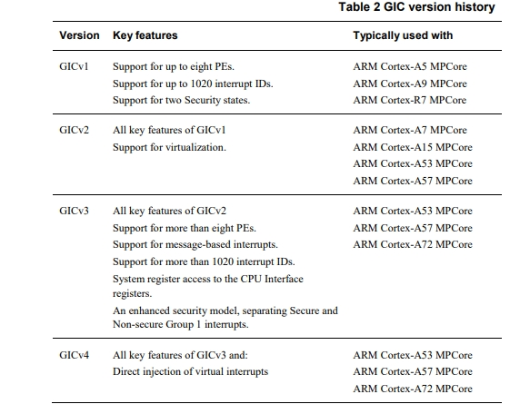
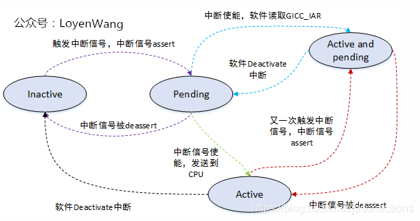

# GIC

## GIC各版本间差别

## 支持的中断类型

**SGI**私有软件触发中断 0~15 用于核间通信 通常用于多核通信

**PPI**私有外设中断 16~31 处理器私有中断 如CPU本地时钟Local timer

**SPI Shared Peripheral Interrupts**公用外设中断 32~1019 外设中断 外设中断，如SPI,I2C，IO等

**LPI Locality-specific Peripheral Interrupts** 特定局部中断

**ITS Interrupt Translation Service**中断传输服务

**MSI Message-Signaled Interrupts**消息信号中断

## 中断状态

- inactive(不活跃)状态：中断处于无效状态；

- pending(等待)状态：中断处于有效状态，但是等待CPU响应该中断；

- active(活跃)状态：CPU已经响应中断；

- active and pending(活跃并等待)状态：CPU正在响应中断，但是该中断源又发送中断过来

转换图如下

1. 读GIC的**GICC_IAR**寄存器，读取行为本身是对中断的ack，会让中断从pending状态进入到active状态

2. 写入**GICC_EOIR**寄存器，通知CPU interface中断处理完成，让中断从active状态进入到inactive状态

3. handle_domain_irq: 对于gic中断控制器会执行gic_of_init初始化，它会创建并注册irq_domain.第一个参数gic->domain就是gic初始化时创建的，它代表了中断控制器。。irqnr为硬中断号，通过硬 中断号可以知道软中断号，然后以软中断号为索引可以获取到irq_desc，进一步获取到irq_data并获取到irqaction进行处理
