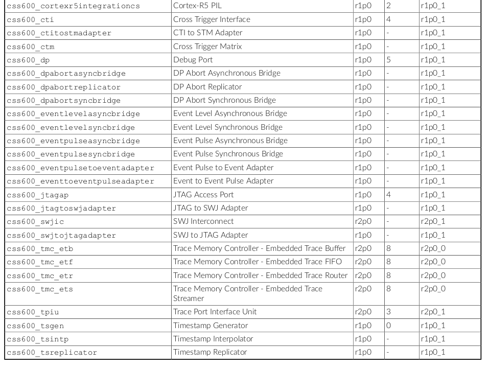

# Coresight

数据流示例：ETM → ATB → Trace Funnel → ATB → TPIU → 外部调试器。

组件协作示例  
多核调试场景：  
CTI 和 CTM 实现核间断点同步。  
ETR 将多个 ETM 的跟踪数据路由到 ETF 缓冲区。  
ROM Table 帮助调试工具自动发现所有组件。  
低带宽环境：  
ETF 缓存数据，TPIU 通过低速 SWO 接口逐步传输。  
ATB 总线确保数据在 CoreSight 内部高效传输。  

ROM Table：系统组件的“地图”，用于自动发现和配置。
ETR/ETF：管理跟踪数据的路由和缓冲，解决带宽瓶颈。
CTI/CTM：实现跨核、跨组件的触发同步，支持复杂调试逻辑。
ATB：专用跟踪总线，确保数据高效传输。