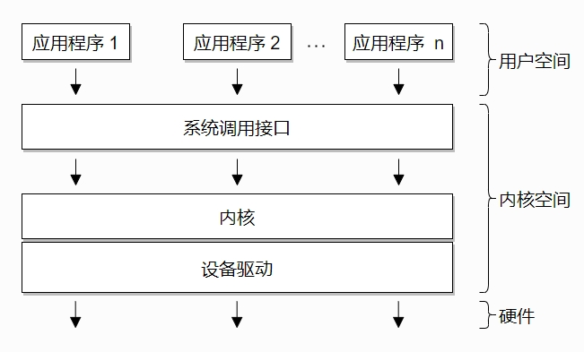
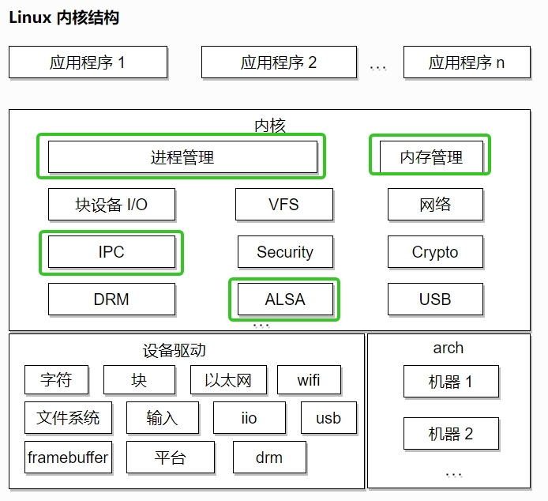

# Linux 内核
<!-- TOC -->

- [什么是中断？](#)
  - [Linux 可延迟操作的速查表](#linux-)

<!-- TOC END -->

[Linux 内核 5.10.14](https://linux-kernel-labs-zh.xyz/lectures/intro.html)

典型操作系统架构：

以下是 Linux 源代码文件夹的顶层目录：

**arch**——包含架构（architecture）特定的代码；每个架构在特定的子文件夹中实现（例如 arm、arm64 以及 x86）

**block**——包含与读写块设备数据相关的块子系统代码：创建块 I/O 请求、调度（scheduling）请求（有几个 I/O 调度程序可用）、合并请求，并将其通过 I/O 堆栈传递给块设备驱动程序

**certs**——使用证书实现签名检查支持

**crypto**——各种加密算法的软件实现，以及允许将这些算法分载到硬件中的框架

**Documentation**——各个子系统的文档、对 Linux 内核命令行选项的描述、对 sysfs 文件和格式的描述以及设备树绑定（支持的设备树节点和格式）

**drivers**——各种设备的驱动程序以及 Linux 驱动程序模型实现（对驱动程序、设备总线及其连接方式的抽象描述）

**firmware**——由各种设备驱动程序使用的二进制或十六进制固件文件

**fs**——虚拟文件系统（通用文件系统代码）以及各种文件系统驱动程序的位置
include**——头文件

**init**——在启动过程中运行的通用（而不是特定于架构的）初始化代码

**ipc**——对各种进程间通信系统（Inter Process Communication）调用的实现，例如消息队列、信号量、共享内存

**kernel**——进程管理代码（包括对内核线程、工作队列的支持）、调度程序（scheduler）、跟踪、时间管理、通用中断代码（generic irq code）以及锁定（locking）

**lib**——各种通用函数，例如排序、校验和、压缩和解压缩、位图操作等

**mm**——内存管理代码，用于物理和虚拟内存，包括页面、SL*B 和 CMA 分配器、交换（swapping）、虚拟内存映射、进程地址空间操作等

**net**——各种网络协议栈的实现，包括IPv4和IPv6；BSD 套接字实现、路由、过滤、数据包调度以及桥接（bridging）等

**samples**——各种驱动程序示例

**scripts**——构建系统的一部分，用于构建模块的脚本，Linux 内核配置器 kconfig，以及其他各种脚本（例如 checkpatch.pl，用于检查补丁（patch）是否符合 Linux 内核的编码风格）

**security**——Linux 安全模块框架的位置，允许扩展默认（Unix）安全模型，以及多个此类扩展的实现，例如 SELinux、smack、apparmor 以及 tomoyo 等

**sound**——ALSA（Advanced Linux Sound System，高级 Linux 声音系统）的位置，以及旧的 Linux 音频框架（OSS）

**tools**——用于测试或与 Linux 内核子系统交互的各种用户空间工具

**usr**——支持在内核映像中嵌入 initrd 文件

**virt**——KVM（内核虚拟机）和 hypervisor（虚拟化管理程序）的位置

## 什么是中断？

中断是一种特殊的事件，它会打断程序的正常执行流程。中断可以由硬件设备甚至 CPU 自身触发。当发生中断时，当前程序的执行流程被暂停，然后运行中断处理程序。中断处理程序运行完毕后，之前程序的执行流程会被恢复。

根据其来源，中断可以分为两类。根据是否可以推迟或临时禁用中断，中断也可以分为另外两类：

**同步中断**，由执行指令触发
**异步中断**，由外部事件触发
**可屏蔽（maskable）中断**
可以被忽略
通过 INT 引脚（pin）发出信号
**非可屏蔽中断**
无法被忽略
通过 NMI 引脚发出信号

同步中断通常被称为异常（exceptions），用于处理处理器在执行指令过程中检测到的条件。除以零和系统调用都是异常的例子。

异步中断通常被称为中断，是由输入/输出设备产生的外部事件。例如，网络卡会触发中断来通知有一个数据包到达。

可屏蔽中断占了中断的大多数，它们允许我们暂时禁用中断，推迟中断处理程序的运行，直到我们重新开启中断。但是，也有一些重要的中断是不能被禁用或推迟的。

**异常**（如页错误、系统调用）不能抢占中断；如果发生这种情况，则被视为漏洞（bug）
**中断**可以抢占异常
**中断**不能抢占另一个中断（以前是可能的）

### Linux 可延迟操作的速查表

**软中断（softIRQ）**
在中断上下文中运行
静态分配
同一个处理程序可以在多个核心上并行运行

**任务（tasklet）**
在中断上下文中运行
可以动态分配
同一个处理程序运行是串行化的

**工作队列（workqueues）**
在进程上下文中运行
由于软中断必须使用可重入函数，这就导致设计上的复杂度变高，作为设备驱动程序的开发者来说，增加了负担。而如果某种应用并不需要在多个CPU上并行执行，那么软中断其实是没有必要的。因此诞生了弥补以上两个要求的tasklet。它具有以下特性：
a）一种特定类型的tasklet只能运行在一个CPU上，不能并行，只能串行执行。
b）多个不同类型的tasklet可以并行在多个CPU上。
c）软中断是静态分配的，在内核编译好之后，就不能改变。但tasklet就灵活许多，可以在运行时改变（比如添加模块时）。
软中断运行在中断上下文中，因此不能阻塞和睡眠，而tasklet使用软中断实现，当然也不能阻塞和睡眠。但如果某延迟处理函数需要睡眠或者阻塞呢？没关系工作队列就可以如您所愿了。  
**实际应用中常用的简单缓存一致性协议是 MESI（根据缓存行状态的首字母缩写命名: Modified（已修改）, Exclusive（独占）, Shared（共享） 和 Invalid（已失效））**

**读屏障 (rmb()，smp_rmb())** 用于确保没有读操作越过屏障；也就是说，在执行屏障之后的第一条指令之前，所有的读操作都已经完成
**写屏障 (wmb()，smp_wmb())** 用于确保没有写操作越过屏障
**简单屏障（mb()，smp_mb()）**用于确保没有读操作或写操作越过屏障

**读-复制-更新（Read Copy Update，RCU）**
读-复制-更新是一种特殊的同步机制，类似于读写锁，但在某些方面有显著的改进（以及一些限制）：
只读：同时进行无锁访问和写访问
写访问仍然需要锁，以避免写者之间的竞争
需要读者进行单向遍历

Kmalloc  
GFP_KERNEL：进程上下文，可以睡眠  
GFP_ATOMIC：进程上下文，不可以睡眠  
GFP_ATOMIC：中断处理程序  
GFP_ATOMIC：软中断  
GFP_ATOMIC：Tasklet  
GFP_DMA | GFP_KERNEL：用于DMA的内存，可以睡眠  
GFP_DMA | GFP_ATOMIC：用于DMA的内存，不可以睡眠  

