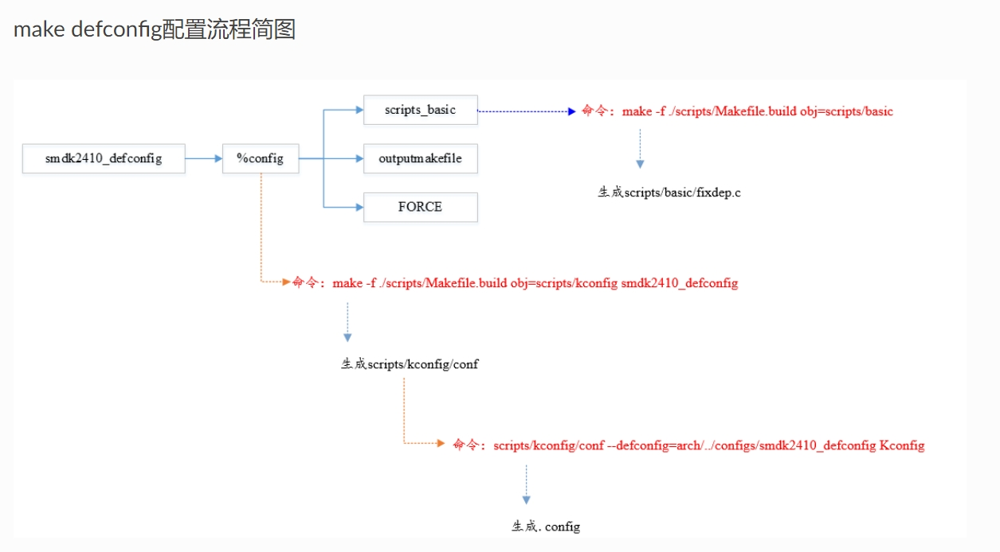
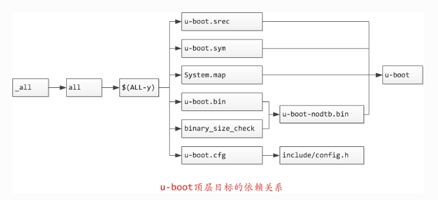
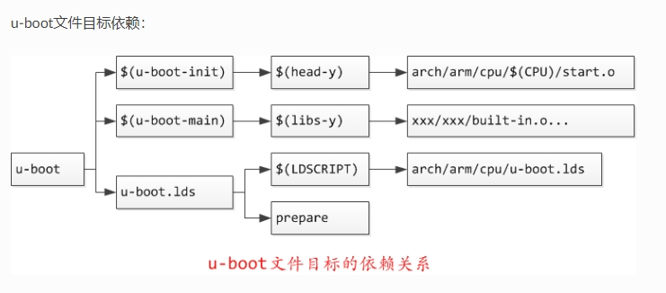
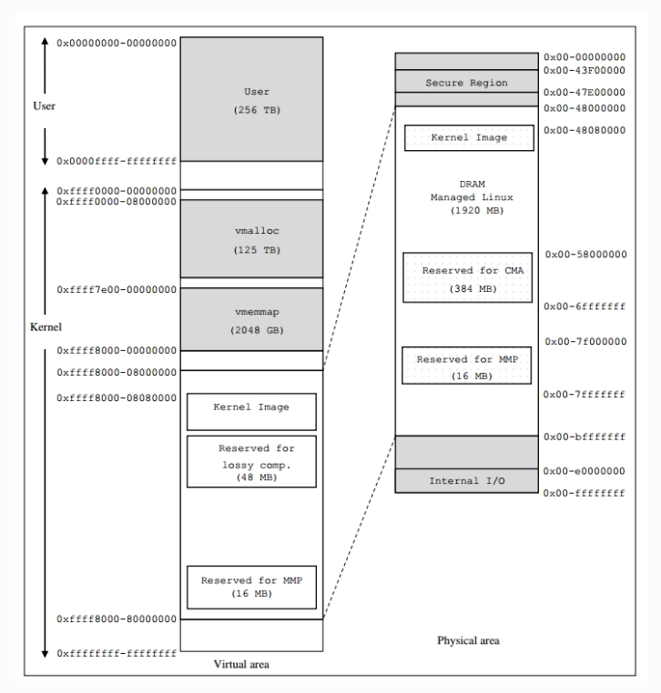
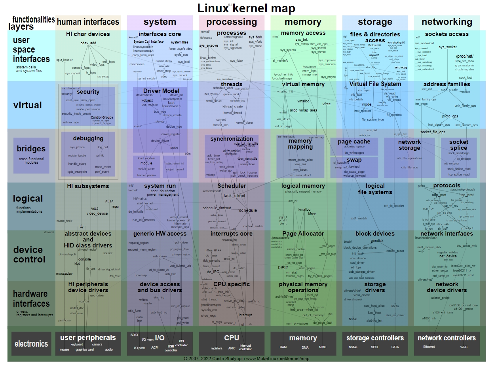

# Linux嵌入式系统开发

[bick开发笔记--Linux嵌入式系统开发](http://www.pedestrian.com.cn/index.html)

## 1. u-boot dev note

### 1.1. uboot编译流程分析

u-boot官方在线文档 <https://u-boot.readthedocs.io/en/latest/index.html>  

这里介绍以下make -f和make -c的区别

- -c选项：Makefile中的-c是递归调用子目录的Makefile，-c选项后跟目录，表示到子目录下执行子目录的makefile，顶层Makefile的export的变量还有make默认的变量是可以传递给子目录中的Makefile的  

- -f选项：顶层Makefile使用make -f调用子目录中的文件（文件名可以随便，不必一定是Makefile）作为Makefile，顶层export的变量可以传递给底层  

在编译uboot时首先执行make xxx_defconfig生成.config文件。  

  

  

  

### 1.2. source analysis

嵌入式系统启动的基本流程是这样的：  

RoomBoot—>SPL—>u-boot—>linux kernel—>file system——>start application  

### 1.3. Legacy-uImage & FIT-uImage

### 1.4. uboot解析uImage的kernel信息

### 1.5. bootm原理

### 1.6. uboot向kernel的传参机制–bootm与tags

### 1.7. uboot-kernel地址空间

  

### 1.8. 多核异构平台系统启动分析

## 2. kernel note

[Linux kernel map](https://makelinux.github.io/kernel/map/)

  

### 2.1. linux kernel debug tools

- kernel-debug之kdump  
- kernel debug之printk  
 **klogd**从纪录缓冲区中获取内核消息，再通过syslogd守护进程把这些消息 保存在系统日志文件中  
 **dmesg**命令也可用于打印和控制内核环缓冲区  
- kernel-debug之debugfs  
内核中有三个常用的伪文件系统: procfs, debugfs,和sysfs

**procfs** 历史最早，用来获取CPU，内存，设备驱动，进程等各种信息  

**sysfs** 跟 kobject 框架紧密联系，而 kobject 是为驱动模型而存在的，所以sysfs是为设备驱动服务的  

**debugfs** 从名字来看就是为debug而生，所以更加灵活  

**relayfs** 是一个快速的转发(relay)数据的文件系统，它以其功能而得名，它为那些需从 内核空间转发大量用户数据到用户空间的工具和应用提供了快速有效的转发机制。  

### 2.2. DTS设备树详解

### 2.3. linux 通用双向循环链表

### 2.4. linux 内核函数

### 2.5. kernel queue note

### 2.6. 进程管理与调度

### 2.7. linux系统调用

### 2.8. kernel 启动流程

### 2.9. linux 内存管理

## 3. linux driver modules note

### 3.1. platform总线

### 3.2. emmc driver

### 3.3. I2C驱动框架以及I2C设备驱动

### 3.4. linux 中断

### 3.5. sysfs、udev以及它们背后的linux统一设备模型

### 3.6. GPIO子系统

### 3.7. kobject详解

### 3.8. 异步通知机制

### 3.9. 以太网驱动

### 3.10. 内核定时器的使用

### 3.11. 输入子系统

### 3.12. framebuffer子系统

### 3.13. DRM框架分析

### 3.14. linux V4L2视频框架

### 3.15. rpmsg应用笔记

## 4. file system note

### 4.1. linux文件系统之sysfs

### 4.2. linux 虚拟文件系统

## 5. application development node

### 5.1. 用户态GPIO操作

### 5.2. C++应用笔记

### 5.3. 汽车功能安全规范及设计

### 5.4. 通信中间件

### 5.5. 视频笔记

### 5.6. 车载应用汇总

### 5.7. linux socket编程

### 5.8. linux 系统编程

### 5.9. 信息安全篇

### 5.10. 配置文件

## 6. misc

### 6.1. linux参考网站

### 6.2. git 使用笔记

### 6.3. shell 使用笔记

### 6.4. 程序调试

### 6.5. 性能优化

### 6.6. vim使用手册

### 6.7. Makfile应用笔记

### 6.8. Cmake学习笔记

### 6.9. 链接脚本

### 6.10. 汇编语言

### 6.11. 数据结构与算法

### 6.12. markdown笔记

## 7. embeded

### 7.1. 嵌入式文件系统

### 7.2. 嵌入式linux 调试总结

### 7.3. gpt分区表

### 7.4. systemd 笔记

### 7.5. ota

### 7.6. 安全启动与加密

### 7.7. Yocto使用总结

### 7.8. 视频相关

### 7.9. 嵌入式系统常见总线

### 7.10. linux 热插拔之udev和mdev

### 7.11. 硬件相关知识点总结

### 7.12. Buildroot笔记

## 8. net

### 8.1. linux 网络概览

### 8.2. TCP/IP详解

### 8.3. AVB笔记

### 8.4. TC-8测试

## 9. rtos note

### 9.1. free_rtos学习笔记
