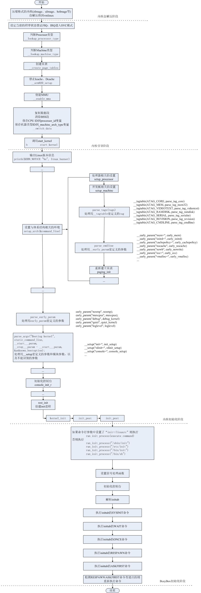

# Linux内核启动流程
<!-- TOC -->


<!-- TOC END -->


[Linux内核启动流程](https://www.cnblogs.com/lcw/p/3337937.html)


> 内核最先执行的文件是head.s，包括内核入口ENTRY(stext)到start_kernel间的初始化代码

```C
void start_kernel(void)
{
 ………………
 page_address_init();
 // 内存相关的初始化
 trap_init();
 mm_init();
 ………………
 // 调度初始化
 sched_init();
 ………………
 rest_init();
}
```

