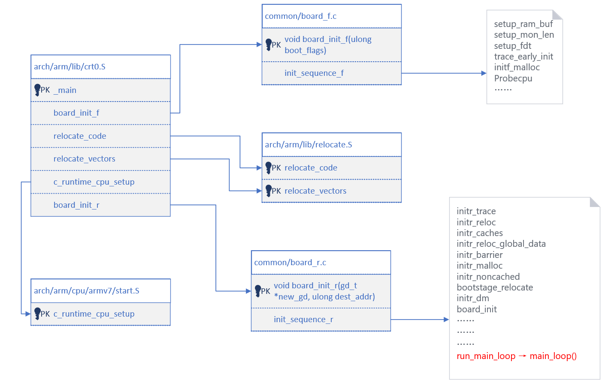

# 【ARM】Uboot代码分析-阿里云开发者社区
<!-- TOC -->

- [UBoot启动过程](#uboot)

<!-- TOC END -->

[【ARM】Uboot代码分析-阿里云开发者社区](https://developer.aliyun.com/article/23878)

[Uboot启动](https://www.cnblogs.com/jzcn/p/16966628.html)

## UBoot启动过程

UBoot其启动过程主要可以分为两个部分，Stage1和Stage2 。其中Stage1是用汇编语言实现的，主要完成硬件资源的初始化。而Stage2则是用C语言实现。主要完成内核程序的调用。这两个部分的主要执行流程如下：

**stage1包含以下步骤：**

1. 硬件设备初始化

2. 为加载stage2准备RAM空间

3. 拷贝stage2的代码到RAM空间

4. 设置好堆栈

5. 跳转到stage2的C语言入口点

**stage2一般包括以下步骤：**

> start_armboot函数是U-Boot执行的第一个C语言函数，主要完成系统的初始化工作，然后进入主循环，等待并处理用户输入的命令。

> 为什么要把从 MEM_START到MEM_START＋0x 8000 这段 32KB 大小的内存空出 来呢？这是因为 Linux 内核要在这段内存中放置一些全局数据结构，如：启动参数和内核页表等信息。为什么要把从 MEM_START到MEM_START＋0x 8000 这段 32KB 大小的内存空出 来呢？这是因为 Linux 内核要在这段内存中放置一些全局数据结构，如：启动参数和内核页表等信息。

1. 初始化本阶段要使用的硬件设备

2. 检测系统内存映射

3. 将kernel映射和根文件系统映射从Flash读到RAM空间中

4. 为内核设置启动参数

5. 调用内核

**在跳转的时候要满足下面的条件：**

a: CPU寄存器的设置

R0 = 0;

R1 = 机器类型ID，

b: CPU必须在SVC模式

c: Cache和MMU的设置：

MMU必须关闭

指令Cache可以打开也可以关闭

数据Cache必须关闭

