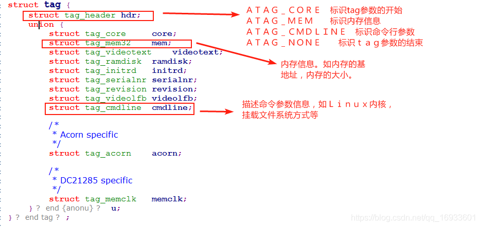
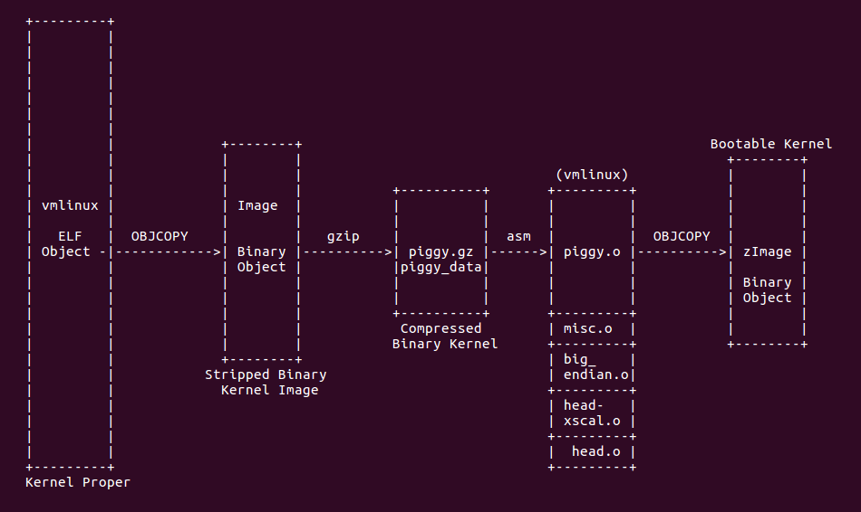

# 超详细分析Bootloader（Uboot）到内核的启动流程（万字长文！）
<!-- TOC -->

- [在跳转到内核以前，uboot需要做好以下三件事情](#uboot)
- [如何给内核传递参数？](#)
- [uboot跳转到Linux内核](#ubootlinux)
- [uboot中bootm命令实现](#ubootbootm)

<!-- TOC END -->

[超详细分析Bootloader（Uboot）到内核的启动流程（万字长文！）](https://cloud.tencent.com/developer/article/1826711)

## 在跳转到内核以前，uboot需要做好以下三件事情

 (1) CPU寄存器的设置

   R0=0。

   R1=机器类型ID；对于ARM结构的CPU，其机器类型ID可以参见 linux/arch/arm tools/ mach-types

   R2=启动参数标记列表在RAM中起始基地址。

 (2) CPU工作模式

   必须禁止中断（IRQs和FIQs）

   CPU必须为SVC模式

 (3) Cache和MMU的设置

   MMU必须关闭

   指令 Cache可以打开也可以关闭

   数据 Cache必须关闭

  其中上面第一步CPU寄存器的设置中，就是通过R0,R1,R2三个参数给内核传递参数的。

## 如何给内核传递参数？

  因此，uboot就把**机器ID通过R1传递给内核**，Linux内核运行的时候首先就从R1中读取机器ID来判断是否支持当前机器。
**R2存放的是块内存的基地址**，这块内存中存放的是uboot给Linux内核的其他参数。这些参数有内存的**起始地址、内存大小、Linux内核启动后挂载文件系统的方式**等信息

## uboot跳转到Linux内核

  在uboot中可以使用go和bootm来跳转到内核，这两个命令的区别如下：

  (1) go命令仅仅修改pc的值到指定地址

  格式：go addr

  (2) bootm命令是uboot专门用来启动uImage格式的Linux内核，它在修改pc的值到指定地址之前，会设置传递给Linux内核的参数，用法如下：

  格式：bootm addr

## uboot中bootm命令实现

  bootm命令在uboot源码common/cmd_bootm.c中实现，它的功能如下：

  （1）读取uImage头部，把内核拷贝到合适的地方。

  （2）把参数给内核准备好。

  （3）引导内核。

> linux内核经过编译后也会生成一个elf格式的可执行程序，叫vmlinux或vmlinuz，这个就是原始的未经任何处理加工的原版内核elf文件；
> vmlinuz/vmlinux，用objcopy工具去制作成烧录镜像格式（就是u-boot.bin这种，但是内核没有.bin后缀），经过制作加工成烧录镜像的文件就叫Image
> 在image压缩后的文件的前端附加了一部分解压缩代码。构成了一个压缩格式的镜像就叫zImage

