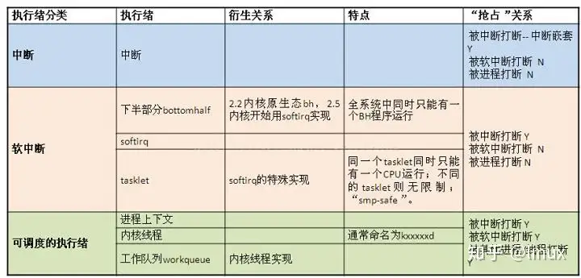

# Linux内核中的软中断、tasklet和工作队列详解
<!-- TOC -->

  - [软中断特性包括](#)
  - [tasklet特性包括](#tasklet)
  - [工作队列](#)

<!-- TOC END -->

[Linux内核中的软中断、tasklet和工作队列详解](https://zhuanlan.zhihu.com/p/265705850)

[Linux内核中的软中断、tasklet和工作队列详解（超详细~）]<https://blog.csdn.net/heli200482128/article/details/126078721>)

下半部主要由软中断、tasklet和工作队列机制构成。  
tasklet是利用软中断实现的一种下半部机制，本质上是软中断的一个变种，运行在中断上下文  

### 软中断特性包括

- 产生后并不是马上可以运行，必须要**等待内核的调度**才能执行，软中断不能被自己打断(即单个CPU上软中断不能嵌套执行)，只能被硬件中断打断(上半部)

- 可以并发运行在多个cpu上(即使同一类型的也可以)，所以软中断必须设计为可重入的函数(允许多个CPU同时操作)，因此也需要使用自旋锁来保其数据结构
- 运行在中断上下文，不能阻塞和睡眠  

### tasklet特性包括

- 一种特定类型的tasklet只能运行在一个CPU上，不能并行，只能串行执行

- 多个不同类型的tasklet可以并行在多个cpu上

- 软中断是静态分配的，在内核编译好之后，就不能改变。但tasklet就灵活许多，可以在运行时改变(如添加模块时)

### 工作队列

工作队列可以把工作推后，交由一个内核线程去执行—这个下半部分总是会在进程上下文执行，但由于是内核线程，**其不能访问用户空间**。最重要特点的就是工作队列**允许重新调度甚至是睡眠**。

