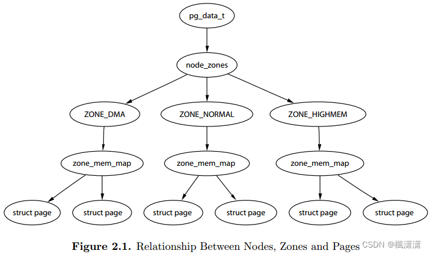
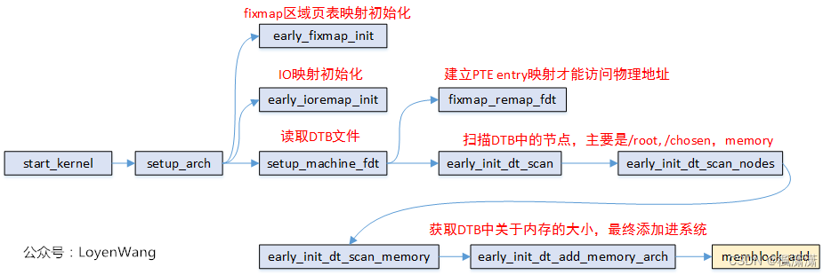
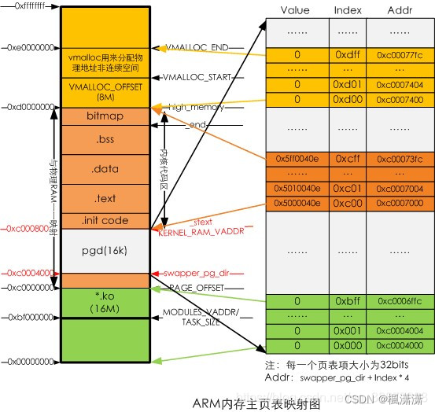

# Linux内存管理初始化

[Linux内存初始化](https://blog.csdn.net/u013836909/category_11623173.html)

[linux内存管理——内存初始化1---物理内存初始化](https://blog.csdn.net/u013836909/article/details/136051700)

## 物理内存初始化文章目录

linux内存管理——内存初始化1---物理内存初始化
1 linux物理内存的组织形式


- 首先, 内存被划分为结点. 每个节点关联到系统中的一个处理器, 内核中表示为pg_data_t的实例.
- 接着各个节点又被划分为内存管理区域, 一个管理区域通过struct zone_struct描述, 其被定义为zone_t, 用以表示内存的某个范围
- 最后页帧(page frame)代表了系统内存的最小单位, 堆内存中的每个页都会创建一个struct page的一个实例.

1.1 内存节点node
1.2 物理内存区域zone

ZONE_DMA : 这个区包含的页用来执行DMA操作。

ZONE_NOMAL : 这个区包含的都是能正常映射的页。

ZONE_HIGHEM : 这个区包”高端内存”，其中的页能不永久地映射到内核地址空间

内核也引入一些逻辑上的内存区.

ZONE_MOVABLE : 内核定义了一个伪内存域ZONE_MOVABLE, 在防止物理内存碎片的机制memory migration中需要使用该内存域. 供防止物理内存碎片的极致使用

ZONE_DEVICE : 为支持热插拔设备而分配的Non Volatile Memory非易失性内存

2 内核空间与用户空间的划分

```C
# define CONFIG_PAGE_OFFSET 0xC0000000
```

在arch/arm/include/asm/memory.h中，可以看出PAGE_OFFSET是用户空间和内核空间的分水岭

3 物理内存初始化流程
3.1 初始化流程框图

3.2 物理内存的获取及memblock
3.2.1 物理内存的获取

在start_kernel–>setup_arch–>setup_machine_fdt–>early_init_dt_scan_nodes–>of_scan_flat_dt(遍历Nodes)–>early_init_dt_scan_memory(初始化单个内存Node)。结果是从DTS解析出base size分别是0x10000000 0x4000000。

3.2.2 add memory
3.3 early_mem init
3.3.1 DTB fixmap
3.3.2 early_ioremap_init
3.3.4 early_mm_init
3.4 arm_memblock_init
3.4.1 kernel镜像内存
3.4.2 initrd内存
3.4.3 PGD页表内存
3.4.4 FDT内存
3.4.5 dma cma内存

[linux内存管理——内存初始化2---分页机制](https://blog.csdn.net/u013836909/article/details/136051958)

## 分页机制文章目录

linux内存管理——内存初始化2---分页机制
1 多级页表的概念
1.1 虚拟内存
1.2 页面大小
1.3 页表级数
1.3.1 linux的二级页表
1.3.2 linux的三级页表
1.3.3 linux的四级页表
1.3.4 PGD: Page Global Directory
1.3.5 PTE: Page Table Entry
1.4 页表带来的问题

>TLB应运而生
>  和CPU的L1、L2、L3的缓存思想一致，既然进行地址转换需要的内存IO次数多，且耗时。那么干脆就在CPU里把页表尽可能地cache起来不就行了么，所以就有了TLB(Translation Lookaside Buffer)，专门用于改进虚拟地址到物理地址转换速度的缓存。其访问速度非常快，和寄存器相当，比L1访问还快。

2 内核页表和进程页表
2.1 主内核页表 swapper_pg_dir
2.2 用户进程页表
2.2.1 进程使用内存
2.2.2 进程的内核全局目录装载过程
2.2.3 用户进程分配



[linux内存管理——内存初始化3---paging_init](https://blog.csdn.net/u013836909/article/details/136052422)

## paging_init文章目录

linux内存管理——内存初始化3---paging_init
1 介绍

> 从Linux内存管理之物理内存初始化中，可知在paging_init调用之前，存放Kernel Image和DTB的两段物理内存区域可以访问了（相应的页表已经建立好）

1.1 arm32页表映射
1.1.1 arm32页表映射过程
1.1.2 ARMv7-AR中关于Short Descriptor映射概览图
1.2 linux页表映射相关数据
1.2.1 mm_struct
1.2.1.1 什么是mm_struct
1.2.1.2 mm_struct的定义
1.2.1.3 init_mm初始化
1.2.3 map_desc
1.2.4 mem_type
1.3 arm32二级页表PTE的定义
2 paging_init分析
2.1 prepare_page_table分析
2.2 map_lowmem分析
2.3 create_mapping分析
2.4 alloc_init_pte分析
2.5 pgd、pud、pmd
3 PTE页表项配置
4 dma_contiguous_remap分析
5 early_fixmap_shutdown分析
6 devicemaps_init分析
7 kmap_init分析
8 bootmem_init分析

[linux内存管理——内存初始化4---mm_init函数分析](https://blog.csdn.net/u013836909/article/details/136052779)

## mm_init函数分析文章目录

linux内存管理——内存初始化4---mm_init函数分析
mm_init分析
mem_init函数分析
set_max_mapnr分析
free_unused_memmap分析
memblock_free_all分析
mem_init_print_info分析

[linux内存管理之CMA](https://blog.csdn.net/u013836909/article/details/136717782)

linux内存管理之CMA文章目录
linux内存管理之CMA
CMA概述
什么是CMA
> CMA，Contiguous Memory Allocator，是内存管理子系统中的一个模块，负责物理地址连续的内存分配，一般我们把这块区域定义为reserved-memory

主要功能包括：

1、解析DTS或者命令行中的参数，确定CMA内存的区域，这样的区域我们定义为CMA area
2、提供**cma_alloc和cma_release**两个接口函数用于分配和释放CMA pages
3、记录和跟踪CMA area中各个pages的状态
4、调用伙伴系统接口，进行真正的内存分配

> 开机时，系统预留出 CMA 区域。  
> 在 CMA 业务不使用时，允许其他业务有条件地使用 CMA 区域，条件是申请页面的属性必须是可迁移的。  
> 当 CMA 业务使用时，把其他业务的页面迁移出 CMA 区域，以满足 CMA 业务的需求。

CMA 数据结构

```C
// 源码：mm/cma.h
struct cma {
 unsigned long   base_pfn; //CMA区域物理地址的起始页帧号；
 unsigned long   count;  //CMA区域总体的页数；

 //位图中每个bit描述的物理页面的order值，其中页面数为2^order值；
 unsigned long   *bitmap; //描述页的分配情况；
 

 //指明该 CMA 区域的 bitmap 中，每个 bit 代表 的 page 数量
 unsigned int order_per_bit; /* Order of pages represented by one bit */
 
 struct mutex    lock;
#ifdef CONFIG_CMA_DEBUGFS
 struct hlist_head mem_head;
 spinlock_t mem_head_lock;
#endif

 //CMA 区域的名字
 const char *name;
};

extern struct cma cma_areas[MAX_CMA_AREAS];
extern unsigned cma_area_count;

```

cma页面类型
cma定义
cma内存域的创建

> CMA area的概念是全局的，通过内核配置参数和命令行参数，

命令行参数建立cma

> 可以通过 “cma=nn[MG]@[start[MG][-end[MG]]]” 这样命令行参数来指明Global CMA area在整个物理内存中的位置  
> 通过内核配置（CMA_SIZE_MBYTES和CMA_SIZE_PERCENTAGE）也可以确定CMA area的参数

device_tree建立cma
device_tree建立global cma area

```C
// 源码：arch/arm/boot/dts/sun4i-a10.dtsi
reserved-memory {
    #address-cells = <1>;
    #size-cells = <1>;
    ranges;

    /* Address must be kept in the lower 256 MiBs of DRAM for VE. */
    default-pool {
        compatible = "shared-dma-pool";
        size = <0x6000000>;
        alloc-ranges = <0x40000000 0x10000000>;
        reusable;
        linux,cma-default;
    };
};

```

**对于CMA区域的dts配置来说，有三个关键点：**

- 第一点，一定要包含有reusable，表示当前的内存区域除了被dma使用之外，还可以被内存管理子系统reuse。
- 第二点，不能包含有no-map属性，该属性表示是否需要创建页表映射，对于通用的内存，必须要创建映射才可以使用，而CMA是可以作为通用内存进行分配使用的，因此必须要创建页表映射。
- 第三点，对于共享的CMA区域，需要配置上linux,cma-default属性，标志着它是共享的CMA。

device_tree建立per device area

```C
//源码：arch/arm/boot/dts/stm32mp157a-dk1.dts
reserved-memory {
  #address-cells = <1>;
  #size-cells = <1>;
  ranges;
                 ....... 
  gpu_reserved: gpu@d4000000 {
   reg = <0xd4000000 0x4000000>;
   no-map;
  };
};

```

> 先在reserved memory中定义专用的CMA区域，注意这里和上面共享的主要区别就是在专用CMA区域中是不包含 linux,cma-default; 属性的。

cma内存初始化流程

**最先进行的是memory type的内存块的建立，可以参考如下代码：**

```C
start_kernel
    ------>setup_arch
        ------>setup_machine_fdt
            ------>early_init_dt_scan_nodes
                ------>of_scan_flat_dt
                    ------>early_init_dt_scan_memory
                        ------>early_init_dt_add_memory_arch
                            ------>memblock_add
```

**随后会建立reserved type的memory block，可以参考如下代码：**

```C
start_kernel
    ------>setup_arch
        ------>arm_memblock_init
            ------>early_init_fdt_scan_reserved_mem
                ------>of_scan_flat_dt
                     ------> __fdt_scan_reserved_mem
                        ------> fdt_init_reserved_mem
                            ------> memblock_add
```

完成上面的初始化之后，memblock模块已经通过device tree构建了整个系统的内存全貌：哪些是普通内存区域，哪些是保留内存区域。对于那些reserved memory，我们还需要进行初始化，代码如下：

```C
start_kernel
    ------>setup_arch
        ------>arm_memblock_init
            ------>early_init_fdt_scan_reserved_mem
                ------>fdt_init_reserved_mem
                    ------>__reserved_mem_init_node

```

device_tree reserved-memory解析
reserved-memory添加到cma子系统
页表与物理页初始化
CMA分配器的激活
分配器使用
cma_alloc 函数
cma_release函数
CMA部署

## start_kernel

`start_kernel`中和内存管理相关的系统初始化函数主要如下：

—->**setup_arch**: 体系机构的设置函数，还负责初始化自举分配器

—->setup_per_cpu_areas: 定义per-cpu变量,为各个cpu分别创建一份这些变量副本

—->build_all_zonelists: 建立节点(node)和内存域(zone)的数据结构

—->mem_init: 停用bootmem分配器并迁移到实际的内存管理函数

—->kmem_cache_init: 初始化内核内部用于小块内存区的分配器

—->setup_per_cpu_pageset: 为各个cpu的zone的pageset数组的第一个数组元素分配内存

## setup_arch

setup_arch

—->machine_specific_memory_setup: 创建一个列表，包括系统占据的内存区和空闲内存区

—->parse_early_param: 解析dtb树命令行

—->setup_memory: 确定每个节点可用的物理内存也数目，初始化bootmem分配器，分配各种内存区

—->paging_init: 初始化内核页表并启动内存分页

```php
---->pagetable_init: 确保直接映射到内核地址空间的物理内存被初始化
```

—->zone_size_init:初始化系统中所有节点的pgdat_t实例

```php
---->add_active_range: 对可用的物理内存建立一个相对简单的列表

---->free_area_init_nodes: 建立完备的内核数据结构
```
