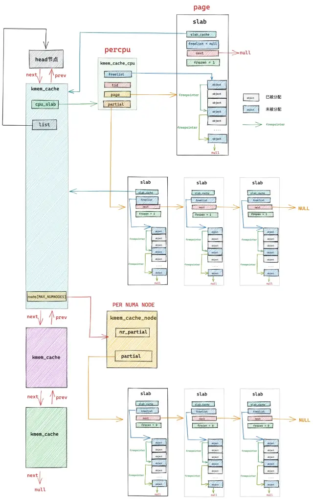

# 内存管理总结
<!-- TOC -->

- [linux内存分配函数异同点](#linux)
- [伙伴算法（Buddy）-- 管理内核页](#buddy---)
  - [简易源码](#)
- [slub算法--管理内核对象](#slub--)
  - [SLUB 的工作原理](#slub-)
  - [slab分配](#slab)
- [缺页中断--页分配不够](#--)
  - [缺页异常的工作流程](#)
- [伙伴系统](#)
- [tcmalloc](#tcmalloc)

<!-- TOC END -->


## linux内存分配函数异同点

| 用户态/内核态 |                API                |             物理地址连续 |                     大小限制                      |                    单位 |                             场景                             |
| :------------ | :-------------------------------: | -----------------------: | :-----------------------------------------------: | ----------------------: | :----------------------------------------------------------: |
| 用户态        |    malloc/calloc/realloc/free     |                   不保证 |                      堆内存                       |                    byte |             calloc初始化为0；realloc改变内存大小             |
| 用户态        |              alloca               |                   不保证 |                      栈内存                       |                    byte |                         向栈申请空间                         |
| 用户态        |            mmap/munmap            |                          |                                                   |                    byte |             将文件利用虚拟内存技术映射到内存中去             |
| 用户态        |             brk,sbrk              |                   不保证 |                      堆内存                       |                    byte |                     虚拟内存到内存的映射                     |
| 内核态        |           vmalloc/vfree           | 虚拟地址连续，物理不确定 | vmalloc区域vmalloc_start~vmalloc_end，比kmalloc慢 |                    byte | 可能睡眠，不能从中断上下文中调用，或其它不允许阻塞情况下调用 |
| 内核态        |  kmalloc/kcalloc/krealloc/kfree   |                 物理连续 |                      64B-4MB                      |       2^order, normal区 | 最大/小值由KMALLOC_MIN_SIZE/KMALLOC_SHIFT_MAX，对应64B/4MB，从/proc/slabinfo中的kmalloc-xxxx中分配，建立在kmem_cache_create基础之上 |
| 内核态        |         kmem_cache_create         |                 物理连续 |                      64B-4MB                      | 字节大小需对齐,normal区 | 便于固定大小数据的频繁分配和释放，分配时从缓存池中获取地址，释放时也不一定真正释放内存。通过slab进行管理 |
| 内核态        | __get_free_page/__get_free_pages  |                 物理连续 |                     0~1024页                      |                normal区 |   __get_free_pages基于alloc_pages，但是限定不能使用HIGHMEM   |
| 内核态        | alloc_page/alloc_pages/free_pages |                 物理连续 |                        4MB                        |                normal区 | CONFIG_FORCE_MAX_ZONEORDER定义了最大页面数2^11，一次能分配到的最大页面数是1024 |

## 伙伴算法（Buddy）-- 管理内核页

> **内核中的伙伴系统管理内存的最小单位是物理内存页 page，全部都是物理上连续的，并且只能分配 2 的整数幂个页**


- alloc_pages(内存分配)概略图

概略图.png)


- __free_pages(内存释放)缩略图

缩略图.png)

### 简易源码

```C
# include <stdio.h>
# include <stdlib.h>
# include <math.h>

# define MIN_ORDER 4
# define MAX_ORDER 10

typedef struct Block {
    int order;
    struct Block* next;
} Block;

Block* free_list[MAX_ORDER + 1];

void initialize() {
    for (int i = MIN_ORDER; i <= MAX_ORDER; i++) {
        free_list[i] = NULL;
    }

    // 初始化最大的内存块
    Block* initial_block = (Block*)malloc(sizeof(Block));
    initial_block->order = MAX_ORDER;
    initial_block->next = NULL;
    free_list[MAX_ORDER] = initial_block;
}

void* allocate(int size) {
    int order = MIN_ORDER;
    while ((1 << order) < size) {
        order++;
    }

    if (order > MAX_ORDER) {
        return NULL; // 请求的内存块太大
    }

    int current_order = order;
    while (current_order <= MAX_ORDER && free_list[current_order] == NULL) {
        current_order++;
    }

    if (current_order > MAX_ORDER) {
        return NULL; // 没有可用的内存块
    }

    Block* block = free_list[current_order];
    free_list[current_order] = block->next;

    while (current_order > order) {
        current_order--;
        Block* buddy = (Block*)((char*)block + (1 << current_order));
        buddy->order = current_order;
        buddy->next = free_list[current_order];
        free_list[current_order] = buddy;
    }

    return (void*)block;
}

void deallocate(void* ptr) {
    Block* block = (Block*)ptr;
    int order = block->order;

    while (order < MAX_ORDER) {
        Block* buddy = (Block*)((char*)block ^ (1 << order));
        Block* current = free_list[order];
        Block* previous = NULL;

        while (current != NULL && current != buddy) {
            previous = current;
            current = current->next;
        }

        if (current != buddy) {
            break;
        }

        if (previous == NULL) {
            free_list[order] = current->next;
        } else {
            previous->next = current->next;
        }

        if (buddy < block) {
            block = buddy;
        }

        order++;
    }

    block->order = order;
    block->next = free_list[order];
    free_list[order] = block;
}

void print_free_list() {
    for (int i = MIN_ORDER; i <= MAX_ORDER; i++) {
        printf("Order %d: ", i);
        Block* current = free_list[i];
        while (current != NULL) {
            printf("%p ", current);
            current = current->next;
        }
        printf("\n");
    }
}

int main() {
    initialize();
    print_free_list();

    void* ptr1 = allocate(16);
    printf("Allocated 16 bytes at %p\n", ptr1);
    print_free_list();

    void* ptr2 = allocate(32);
    printf("Allocated 32 bytes at %p\n", ptr2);
    print_free_list();

    deallocate(ptr1);
    printf("Deallocated 16 bytes from %p\n", ptr1);
    print_free_list();

    deallocate(ptr2);
    printf("Deallocated 32 bytes from %p\n", ptr2);
    print_free_list();

    return 0;
}

```

## slub算法--管理内核对象

SLUB 分配器将内存分成若干个 slab，每个 slab 包含若干个对象。SLUB 通过维护空闲对象列表来管理内存分配和回收。当需要分配内存时，SLUB 从空闲对象列表中分配一个对象；当释放内存时，SLUB 将对象放回空闲对象列表。
**slab 内存池就是专门应对小内存频繁的分配和释放的场景的**

slab 首先会向伙伴系统一次性申请一个或者多个物理内存页面，正是这些物理内存页组成了 slab 内存池。

随后 slab 内存池会将这些连续的物理内存页面划分成多个大小相同的小内存块出来，同一种 slab 内存池下，划分出来的小内存块尺寸是一样的。内核会针对不同尺寸的小内存分配需求，预先创建出**多个 slab 内存池**出来。

这种小内存在内核中的使用场景非常之多，比如，内核中那些经常使用，需要频繁申请释放的一些核心数据结构对象：task_struct 对象，mm_struct 对象，struct page 对象，struct file 对象，socket 对象等。

将内核中的核心数据结构对象，池化在 slab 对象池中，除了可以避免内核对象频繁反复初始化和相关内存分配，频繁反复销毁对象和相关内存释放的性能开销之外，其实还有很多好处，比如：

- 利用 CPU 高速缓存提高访问速度。当一个对象被直接释放回 slab 对象池中的时候，这个内核对象还是“热的”，仍然会驻留在 CPU 高速缓存中。如果这时，内核继续向 slab 对象池申请对象，slab 对象池会优先把这个刚刚释放 “热的” 对象分配给内核使用，因为对象很大概率仍然驻留在 CPU 高速缓存中，所以内核访问起来速度会更快。

- 伙伴系统只能分配 2 的次幂个完整的物理内存页，这会引起占用高速缓存以及 TLB 的空间较大，导致一些不重要的数据驻留在 CPU 高速缓存中占用宝贵的缓存空间，而重要的数据却被置换到内存中。 slab 对象池针对小内存分配场景，可以有效的避免这一点。

- 调用伙伴系统的操作会对 CPU 高速缓存 L1Cache 中的 Instruction Cache（指令高速缓存）和 Data Cache （数据高速缓存）有污染，因为对伙伴系统的长链路调用，相关的一些指令和数据必然会填充到  Instruction Cache 和 Data Cache 中，从而将频繁使用的一些指令和数据挤压出去，造成缓存污染。而在内核空间中越浪费这些缓存资源，那么在用户空间中的进程就会越少的得到这些缓存资源，造成性能的下降。 slab 对象池极大的减少了对伙伴系统的调用，防止了不必要的 L1Cache 污染。

- 使用 slab 对象池可以充分利用 CPU 高速缓存，避免多个对象对同一 cache line 的争用。如果对象直接存储排列在伙伴系统提供的内存页中的话（不受 slab 管理），那么位于不同内存页中具有相同偏移的对象很可能会被放入同一个 cache line 中，即使其他 cache line 还是空的。  
**slab对象内存布局**

**slub_cache架构图**


### SLUB 的工作原理

SLUB 的核心是缓存 (cache) 机制。每个缓存管理一种特定大小的内存对象，并将这些对象分配到特定的内存区域 (slab) 中。

1. 缓存结构
SLUB 为每种大小的对象维护一个缓存结构 (kmem_cache)，包含以下关键字段：

对象大小 (object size)：每个对象的大小。
slab 列表：包含对象的内存区域列表。
CPU 缓存 (cpu_cache)：每个 CPU 拥有的缓存，用于快速分配和释放对象。
2. 分配对象
当请求分配一个对象时，SLUB 会执行以下步骤：

检查 CPU 缓存：首先检查当前 CPU 缓存中是否有空闲对象，如果有则直接分配。
分配新 slab：如果 CPU 缓存没有空闲对象，则分配一个新的 slab 并将对象从中分配出来。
更新缓存：将新分配的 slab 更新到 CPU 缓存中，以便后续分配。
3. 释放对象
当释放一个对象时，SLUB 会执行以下步骤：

放回 CPU 缓存：将对象放回当前 CPU 的缓存中。
合并空闲 slab：如果 slab 中所有对象都被释放，则将 slab 合并到全局空闲列表中。

简易源码：
**内核会将这些 slab cache 用一个双向链表统一串联起来。链表的头结点指针保存在 struct kmem_cache 结构的 list 中。**

> 进程需要向 slab cache 申请对应的内存块（object）时，首先会直接来到 kmem_cache_cpu 中查看   cpu 本地缓存的 slab，如果本地缓存的 slab 中有空闲对象，那么就直接返回了，整个过程完全没有加锁

```C
//
/*
 * Slab cache management.
 */
struct kmem_cache {
    // slab cache 的管理标志位，用于设置 slab 的一些特性
    // 比如：slab 中的对象按照什么方式对齐，对象是否需要 POISON  毒化，是否插入 red zone 在对象内存周围，是否追踪对象的分配和释放信息 等等
    slab_flags_t flags;
    // slab 对象在内存中的真实占用，包括为了内存对齐填充的字节数，red zone 等等
    unsigned int size;  /* The size of an object including metadata */
    // slab 中对象的实际大小，不包含填充的字节数
    unsigned int object_size;/* The size of an object without metadata */
    // slab 对象池中的对象在没有被分配之前，我们是不关心对象里边存储的内容的。
    // 内核巧妙的利用对象占用的内存空间存储下一个空闲对象的地址。
    // offset 表示用于存储下一个空闲对象指针的位置距离对象首地址的偏移
    unsigned int offset;    /* Free pointer offset */
    // 表示 cache 中的 slab 大小，包括 slab 所需要申请的页面个数，以及所包含的对象个数
    // 其中低 16 位表示一个 slab 中所包含的对象总数，高 16 位表示一个 slab 所占有的内存页个数。
    struct kmem_cache_order_objects oo;
    // slab 中所能包含对象以及内存页个数的最大值
    struct kmem_cache_order_objects max;
    // 当按照 oo 的尺寸为 slab 申请内存时，如果内存紧张，会采用 min 的尺寸为 slab 申请内存，可以容纳一个对象即可。
    struct kmem_cache_order_objects min;
    // 向伙伴系统申请内存时使用的内存分配标识
    gfp_t allocflags; 
    // slab cache 的引用计数，为 0 时就可以销毁并释放内存回伙伴系统重
    int refcount;   
    // 池化对象的构造函数，用于创建 slab 对象池中的对象
    void (*ctor)(void *);
    // 对象的 object_size 按照 word 字长对齐之后的大小
    unsigned int inuse;  
    // 对象按照指定的 align 进行对齐
    unsigned int align; 
    // slab cache 的名称， 也就是在 slabinfo 命令中 name 那一列
    const char *name;  
};

# include <linux/module.h>
# include <linux/kernel.h>
# include <linux/slab.h>
# include <linux/init.h>

# define CACHE_NAME "slub_example_cache"
# define OBJECT_SIZE 128

static struct kmem_cache *example_cache;

static int __init slub_example_init(void)
{
    void *object;

    // 创建一个 kmem_cache
    example_cache = kmem_cache_create(CACHE_NAME, OBJECT_SIZE, 0, SLAB_HWCACHE_ALIGN, NULL);
    if (!example_cache) {
        printk(KERN_ERR "Failed to create SLUB cache\n");
        return -ENOMEM;
    }

    printk(KERN_INFO "SLUB cache created: %s\n", CACHE_NAME);

    // 分配对象
    object = kmem_cache_alloc(example_cache, GFP_KERNEL);
    if (!object) {
        printk(KERN_ERR "Failed to allocate object from SLUB cache\n");
        kmem_cache_destroy(example_cache);
        return -ENOMEM;
    }

    printk(KERN_INFO "Object allocated: %p\n", object);

    // 释放对象
    kmem_cache_free(example_cache, object);
    printk(KERN_INFO "Object freed: %p\n", object);

    return 0;
}

static void __exit slub_example_exit(void)
{
    // 销毁 kmem_cache
    if (example_cache) {
        kmem_cache_destroy(example_cache);
        printk(KERN_INFO "SLUB cache destroyed: %s\n", CACHE_NAME);
    }
}

module_init(slub_example_init);
module_exit(slub_example_exit);

MODULE_LICENSE("GPL");
MODULE_DESCRIPTION("SLUB Example Module");
MODULE_AUTHOR("Your Name");

```


### slab分配

> 从本地 cpu 缓存中直接分配->从本地 cpu 缓存 partial 列表中分配->从 NUMA 节点缓存中分配->从伙伴系统中重新申请 slab


## 缺页中断--页分配不够

缺页异常（Page Fault）是一种在操作系统中常见的中断，发生在CPU尝试访问一个没有映射到物理内存的虚拟内存页时。缺页异常是虚拟内存管理机制的重要组成部分，通过它可以实现内存的按需分配、页面置换以及内存保护。

### 缺页异常的工作流程

**下面总结下缺页异常的几种情况：**
1、当MMU中确实没有创建虚拟页物理页映射关系，并且在该虚拟地址之后再没有当前进程的线性区vma的时候，可以肯定这是一个编码错误，这将杀掉该进程；
2、当MMU中确实没有创建虚拟页物理页映射关系，并且在该虚拟地址之后存在当前进程的线性区vma的时候，这很可能是缺页异常，并且可能是栈溢出导致的缺页异常；
3、当使用malloc/mmap()等希望访问物理空间的库函数/系统调用后，由于linux并未真正给新创建的vma映射物理页，此时若先进行写操作，将如上面的2的情况产生缺页异常，若先进行读操作虽也会产生缺页异常，将被映射给默认的零页(zero_pfn)，等再进行写操作时，仍会产生缺页异常，这次必须分配物理页了，进入写时复制的流程；
4、当使用fork()等系统调用创建子进程时，子进程不论有无自己的vma，“它的”vma都有对于物理页的映射，但它们共同映射的这些物理页属性为只读，即linux并未给子进程真正分配物理页，当父子进程任何一方要写相应物理页时，导致缺页异常的写时复制；

当程序访问一个不在物理内存中的虚拟地址时，处理器会触发缺页异常中断。操作系统内核接管控制权，并进行一系列处理来解决缺页异常，具体流程如下：

- **触发缺页异常**：程序访问一个无效的虚拟地址，导致处理器触发缺页异常。
- **保存 CPU 状态**：处理器将当前状态（如寄存器内容、程序计数器等）保存到内核堆栈，以便中断处理完成后能恢复执行。
- **查找页表**：操作系统内核根据虚拟地址查找对应的页表项，以确定缺页的原因。
- **判断缺页原因**：根据页表项状态，确定是页面未分配、页面置换出内存还是非法访问：
- **页面未分配**：为虚拟地址分配一个新的物理页面，并更新页表。
- **页面置换**：如果页面被换出到硬盘，则从硬盘加载页面到物理内存，并更新页表。
- **非法访问**：如果访问是非法的（例如，试图写入只读页面），则触发段错误（segmentation fault）信号，终止进程。
- **更新页表**：根据分配或加载的物理页面，更新页表项，使其指向新的物理页面。
- **恢复执行**：恢复保存的CPU状态，继续执行被中断的程序。


## 伙伴系统

伙伴系统是分离适配的一种特例。它的每个大小类的空闲链表包含大小相等的块，并且大小都是 2 的幂。最开始时，全局只有一个大小为 2m2m 字的空闲块，2m2m 是堆的大小。  

假设分配的块的大小都是 2 的幂，为了分配一个大小为 2k2k 的块，需要找到大小恰好是 2k2k 的空闲块。如果找到，则整体分配。如果没有找到，则将刚好比它大的块分割成两块，每个剩下的半块（也叫做伙伴）被放置在相应的空闲链表中，以此类推，直到得到大小恰好是 2k2k 的空闲块。释放一个大小为 2k2k 的块时，将其与空闲的伙伴合并，得到新的更大的块，以此类推，直到伙伴已分配时停止合并。  

伙伴系统分配器的主要优点是它的快速搜索和快速合并。主要缺点是要求块大小为 2 的幂可能导致显著的内部碎片。因此，伙伴系统分配器不适合通用目的的工作负载。然而，对于某些特定应用的工作负载，其中块大小预先知道是 2 的幂，伙伴系统分配器就很有吸引力了。

## tcmalloc

tcmalloc 是 Google 开发的内存分配器，全称 Thread-Caching Malloc，即线程缓存的 malloc，实现了高效的多线程内存管理。  

tcmalloc 主要利用了池化思想来管理内存分配。对于每个线程，都有自己的私有缓存池，内部包含若干个不同大小的内存块。对于一些小容量的内存申请，可以使用线程的私有缓存；私有缓存不足或大容量内存申请时再从全局缓存中进行申请。在线程内分配时不需要加锁，因此在多线程的情况下可以大大提高分配效率。  

