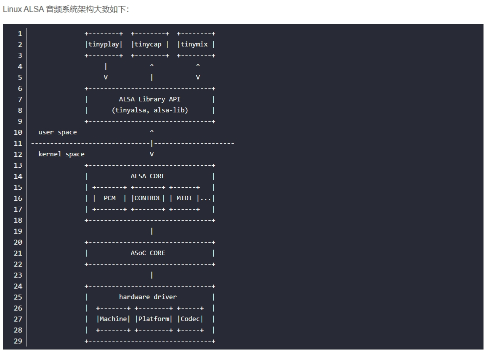
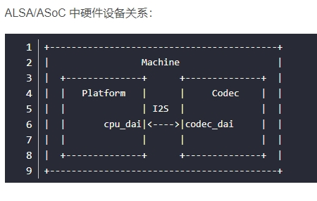
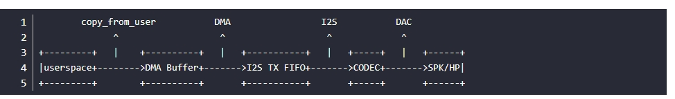
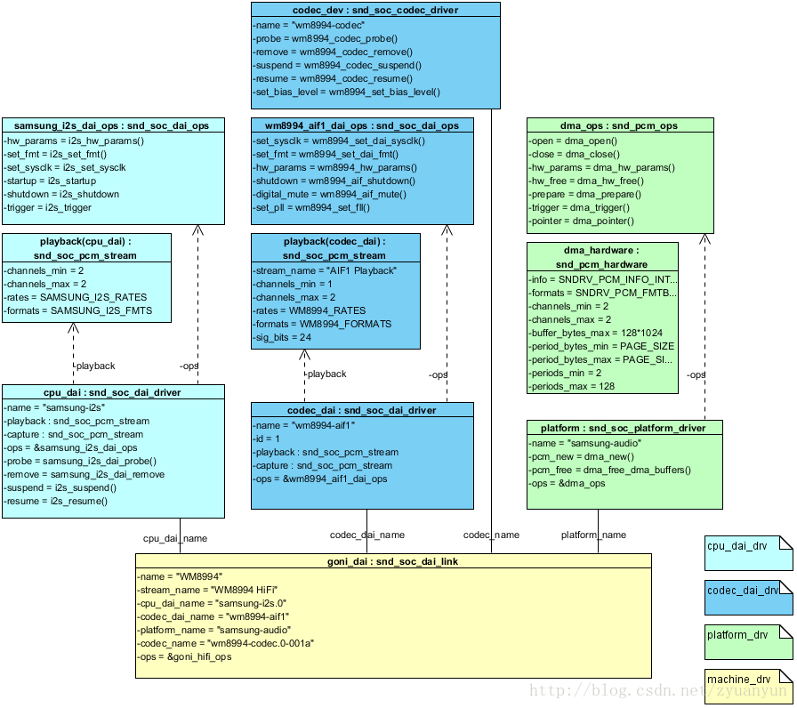

# ALSA 音频系统：物理链路篇

[ALSA 音频系统：物理链路篇](https://blog.csdn.net/zyuanyun/article/details/59170418)

**Platform**：指某款 SoC 平台的音频模块，如 exynos、omap、qcom 等等。Platform 又可细分两部分：

- cpu dai：在嵌入式系统里面通常指 SoC 的 I2S、PCM 总线控制器，负责把音频数据从 I2S tx FIFO 搬运到 CODEC（这是回放的情形，录制则方向相反）。cpu_dai 通过 **snd_soc_register_dai()** 来注册。注：DAI 是 **Digital Audio Interface** 的简称，分为 cpu_dai 和 codec_dai，这两者通过 I2S/PCM 总线连接；AIF 是 Audio Interface 的简称，嵌入式系统中一般是 I2S 和 PCM 接口。
- pcm dma：负责把 dma buffer 中的音频数据搬运到 I2S tx FIFO。值得留意的是：某些情形下是不需要 dma 操作的，比如 Modem 和 CODEC 直连，因为 Modem 本身已经把数据送到 FIFO 了，这时只需启动 codec_dai 接收数据即可；该情形下，Machine 驱动 dai_link 中需要设定 .platform_name = **"snd-soc-dummy", 这是虚拟 dma 驱动**，实现见 sound/soc/soc-utils.c。音频 dma 驱动通过 **snd_soc_register_platform()** 来注册，故也常用 platform 来指代音频 dma 驱动（这里的 platform 需要与 SoC Platform 区分开）。  

**Codec**：对于回放来说，userspace 送过来的音频数据是经过采样量化的**数字信号，在 codec 经过 DAC 转换成模拟信号**然后输出到外放或耳机，这样我们就可以听到声音了。Codec 字面意思是编解码器，但芯片里面的功能部件很多，常见的有 AIF、DAC、ADC、Mixer、PGA、Line-in、Line-out，有些高端的 codec 芯片还有 EQ、DSP、SRC、DRC、AGC、Echo-Canceller、Noise-Suppression 等部件。

**Machine**：指某款机器，通过配置 dai_link 把 cpu_dai、codec_dai、modem_dai 各个音频接口给链结成一条条音频链路，然后注册 snd_soc_card。和上面两个不一样，Platform 和 CODEC 驱动一般是可以重用的，而 Machine 有它特定的硬件特性，几乎是不可重用的。所谓的硬件特性指：SoC Platform 与 Codec 的差异；DAIs 之间的链结方式；通过某个 GPIO 打开 Amplifier；通过某个 GPIO 检测耳机插拔；使用某个时钟如 MCLK/External-OSC 作为 I2S、CODEC 的时钟源等等。

对于回放的情形，PCM 数据流向大致是：

**snd_soc_codec_driver**：音频编解码芯片描述及操作函数，如控件/微件/音频路由的描述信息、时钟配置、IO 控制等
**snd_soc_dai_driver**：音频数据接口描述及操作函数，根据 codec 端和 soc 端，分为 codec_dai 和 cpu_dai
**snd_soc_platform_driver**：音频 dma 设备描述及操作函数
**snd_soc_dai_link**：音频链路描述及板级操作函数

