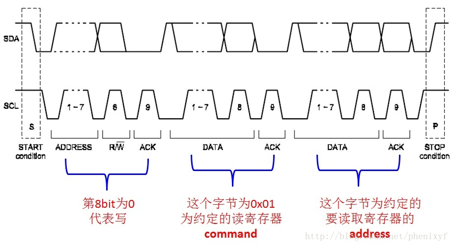
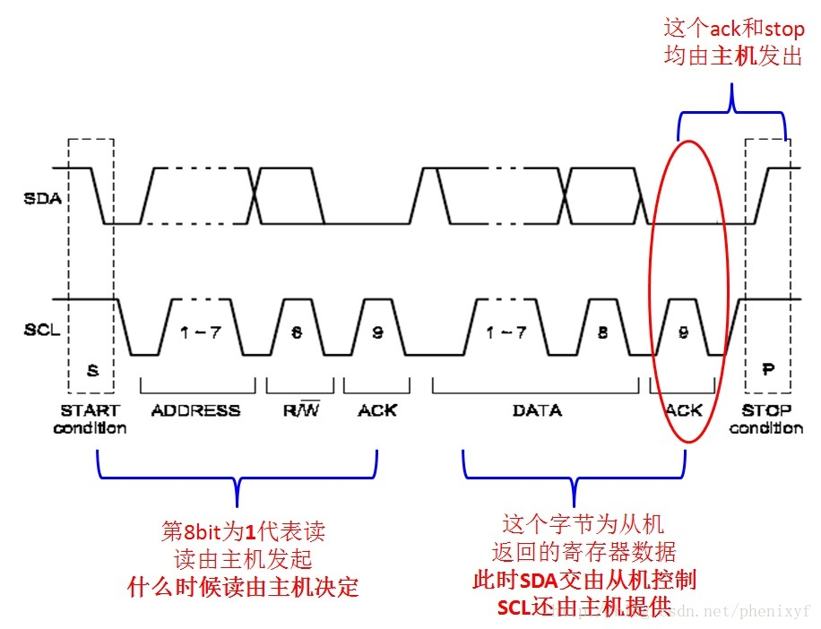

# I2C驱动

### I2C总线

```C
struct bus_type i2c_bus_type = {
    .name           = "i2c",
    .match          = i2c_device_match, //匹配规则
    .probe          = i2c_device_probe, //匹配成功后的行为
    .remove         = i2c_device_remove,
    .shutdown       = i2c_device_shutdown,
    .pm             = &i2c_device_pm_ops,
};
```

I2C总线对应这/bus下的一条总线，这个I2C总线结构体管理着I2C设备与I2C驱动的匹配，删除等操作，当设备或者驱动注册到总线时，I2C总线会调用i2c_device_match函数查看I2C设备和驱动是否匹配，如果匹配则调用i2c_device_probe函数 ，进而调用I2C驱动的probe函数。

注：i2c_device_match会管理i2c设备和总线匹配规则，这将和如何编写I2C驱动程序息息相关。

### I2C驱动

```C
struct i2c_driver {
    int (*probe)(struct i2c_client*, const struct i2c_device_id *); //probe函数
    struct device_driver driver; //表明这是一个驱动
    const struct i2c_device_id*id_table; //要匹配的从设备信息(名称)
    int (*detect)(struct i2c_client*, struct i2c_board_info *); //设备探测函数
    const unsigned short*address_list; //设备地址
    struct list_head clients; //设备链表
};
```

### I2C设备

```C
struct i2c_client {
    unsigned short addr; //设备地址
    char name[I2C_NAME_SIZE]; //设备名称
    struct i2c_adapter *adapter; //适配器，I2C控制器。
    struct i2c_driver*driver; //设备对应的驱动
    struct device dev; //表明这是一个设备
    int irq; //中断号
    struct list_head detected; //节点
};
```

### I2C适配器

i2c_adapter对应物理上的一个i2c适配器

```C
struct i2c_adapter {    //适配器
    unsigned int id; //适配器的编号
    const struct i2c_algorithm *algo; //算法，发送时序
    struct device dev; //表明这是一个设备
};
```

i2c_algorithm 对应着一套通讯方法

```C
struct i2c_algorithm {
    /*作为主设备时的发送函数*/
    int (*master_xfer)(struct i2c_adapter*adap, struct i2c_msg *msgs,
               int num);

    /* 作为从设备时的发送函数 */
    int (*smbus_xfer) (struct i2c_adapter *adap, u16 addr,
               unsigned short flags, char read_write,
               u8 command, int size, union i2c_smbus_data *data);
};
```

I2C驱动有4个重要的东西，I2C总线、I2C驱动、I2C设备、I2C适配器

- I2C总线：维护着两个链表(I2C驱动，I2C设备)，管理着I2C设备和驱动的匹配以及删除

- I2C驱动：对应着I2C设备驱动程序

- I2C设备：对应着具体硬件设备的抽象

- I2C适配器： 用于I2C驱动和I2C设备间的通讯，是SOC上I2C控制器的一个抽象




