# v4l2的学习建议和流程解析
<!-- TOC -->

- [调用v4l2的工作流程](#v4l2)
- [文字描述版流程](#)
- [用户空间参考示例](#)
- [V4L2驱动](#v4l2)
  - [常见的硬件拓扑结构](#)
  - [数据结构](#)
  - [调用控制流程-控制流](#-)
  - [数据流](#)

<!-- TOC END -->


[v4l2的学习建议和流程解析](https://www.cnblogs.com/silence-hust/p/4464291.html)
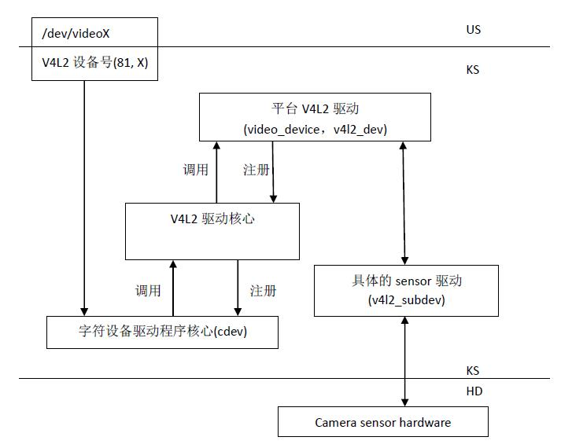

V4L2支持两种方式来采集图像：内存映射方式(mmap)和直接读取方式(read)

V4L2规范中不仅定义了通用API元素(Common API Elements)，图像的格式(Image Formats)，输入/输出方法(Input/Output)，还定义了Linux内核驱动处理视频信息的一系列接口(Interfaces)，这些接口主要有：

- 视频采集接口——Video Capture Interface;

- 视频输出接口—— Video Output Interface;

- 视频覆盖/预览接口——Video Overlay Interface;

- 视频输出覆盖接口——Video Output Overlay Interface;

- 编解码接口——Codec Interface。

## 调用v4l2的工作流程

**打开设备－> 检查和设置设备属性－> 设置帧格式－> 设置一种输入输出方法（缓冲 区管理）－> 循环获取数据－> 关闭设备。**

## 文字描述版流程

(1)打开视频设备文件。int fd=open("/dev/video0",O_RDWR);

(2)查询视频设备的能力，比如是否具有视频输入,或者音频输入输出等。ioctl(fd_v4l, VIDIOC_QUERYCAP, &cap)

(3)设置视频采集的参数

　　设置视频的制式，制式包括PAL/NTSC，使用ioctl(fd_v4l, VIDIOC_S_STD, &std_id)

　　设置视频图像的采集窗口的大小，使用ioctl(fd_v4l, VIDIOC_S_CROP, &crop)

　　设置视频帧格式，包括帧的点阵格式，宽度和高度等，使用ioctl(fd_v4l, VIDIOC_S_FMT, &fmt)

　　设置视频的帧率，使用ioctl(fd_v4l, VIDIOC_S_PARM, &parm)

　　设置视频的旋转方式，使用ioctl(fd_v4l, VIDIOC_S_CTRL, &ctrl)

(4)向驱动申请视频流数据的帧缓冲区

　　请求/申请若干个帧缓冲区，一般为不少于3个,使用ioctl(fd_v4l, VIDIOC_REQBUFS, &req)

　　查询帧缓冲区在内核空间中的长度和偏移量 ioctl(fd_v4l, VIDIOC_QUERYBUF, &buf)

(5)应用程序通过内存映射，将帧缓冲区的地址映射到用户空间，这样就可以直接操作采集到的帧了，而不必去复制。

　　buffers[i].start = mmap (NULL, buffers[i].length, PROT_READ | PROT_WRITE, MAP_SHARED, fd_v4l, buffers[i].offset);

(6)将申请到的帧缓冲全部放入视频采集输出队列，以便存放采集的数据。ioctl (fd_v4l, VIDIOC_QBUF, &buf)

(7)开始视频流数据的采集。 ioctl (fd_v4l, VIDIOC_STREAMON, &type)

(8) 驱动将采集到的一帧视频数据存入输入队列第一个帧缓冲区，存完后将该帧缓冲区移至视频采集输出队列。

(9)应用程序从视频采集输出队列中取出已含有采集数据的帧缓冲区。ioctl (fd_v4l, VIDIOC_DQBUF, &buf) ，应用程序处理该帧缓冲区的原始视频数据。

(10)处理完后，应用程序的将该帧缓冲区重新排入输入队列,这样便可以循环采集数据。ioctl (fd_v4l, VIDIOC_QBUF, &buf)

　　重复上述步骤8到10，直到停止采集数据。

(11)停止视频的采集。ioctl (fd_v4l, VIDIOC_STREAMOFF, &type)

(12)释放申请的视频帧缓冲区unmap，关闭视频设备文件close(fd_v4l)。

以上的程序流程，包含了视频设备采集连续的视频数据的逻辑关系。而在实际运用中，往往还要加入对视频数据进行处理(如压缩编码)的工作，否则，视频流数据量相当大，需要很大的存储空间和传输带宽。

## 用户空间参考示例

```C
# include <stdio.h>
# include <stdlib.h>
# include <string.h>
# include <fcntl.h>
# include <unistd.h>
# include <errno.h>
# include <sys/ioctl.h>
# include <linux/videodev2.h>
# include <sys/mman.h>

// 设备文件路径
# define DEVICE_FILE "/dev/video0"
// 缓冲区数量
# define BUFFER_COUNT 4

struct buffer {
    void *start;
    size_t length;
};

int main() {
    int fd;
    struct v4l2_capability cap;
    struct v4l2_format fmt;
    struct v4l2_requestbuffers req;
    struct v4l2_buffer buf;
    enum v4l2_buf_type type;
    struct buffer *buffers;
    unsigned int i;

    // 1. 打开设备
    fd = open(DEVICE_FILE, O_RDWR);
    if (fd == -1) {
        perror("Opening video device");
        return 1;
    }

    // 2. 查询设备能力
    if (ioctl(fd, VIDIOC_QUERYCAP, &cap) == -1) {
        perror("Querying Capabilities");
        return 1;
    }

    // 3. 设置视频格式
    memset(&fmt, 0, sizeof(fmt));
    fmt.type = V4L2_BUF_TYPE_VIDEO_CAPTURE;
    fmt.fmt.pix.width = 640;
    fmt.fmt.pix.height = 480;
    fmt.fmt.pix.pixelformat = V4L2_PIX_FMT_YUYV;
    fmt.fmt.pix.field = V4L2_FIELD_NONE;

    if (ioctl(fd, VIDIOC_S_FMT, &fmt) == -1) {
        perror("Setting Pixel Format");
        return 1;
    }

    // 4. 请求缓冲区
    memset(&req, 0, sizeof(req));
    req.count = BUFFER_COUNT;
    req.type = V4L2_BUF_TYPE_VIDEO_CAPTURE;
    req.memory = V4L2_MEMORY_MMAP;

    if (ioctl(fd, VIDIOC_REQBUFS, &req) == -1) {
        perror("Requesting Buffer");
        return 1;
    }

    // 5. 查询缓冲区并映射到用户空间
    buffers = calloc(req.count, sizeof(*buffers));
    for (i = 0; i < req.count; ++i) {
        memset(&buf, 0, sizeof(buf));
        buf.type = V4L2_BUF_TYPE_VIDEO_CAPTURE;
        buf.memory = V4L2_MEMORY_MMAP;
        buf.index = i;

        if (ioctl(fd, VIDIOC_QUERYBUF, &buf) == -1) {
            perror("Querying Buffer");
            return 1;
        }

        buffers[i].length = buf.length;
        buffers[i].start = mmap(NULL, buf.length, PROT_READ | PROT_WRITE, MAP_SHARED, fd, buf.m.offset);

        if (buffers[i].start == MAP_FAILED) {
            perror("Mapping Buffer");
            return 1;
        }
    }

    // 6. 启动视频流
    for (i = 0; i < req.count; ++i) {
        memset(&buf, 0, sizeof(buf));
        buf.type = V4L2_BUF_TYPE_VIDEO_CAPTURE;
        buf.memory = V4L2_MEMORY_MMAP;
        buf.index = i;

        if (ioctl(fd, VIDIOC_QBUF, &buf) == -1) {
            perror("Queue Buffer");
            return 1;
        }
    }

    type = V4L2_BUF_TYPE_VIDEO_CAPTURE;
    if (ioctl(fd, VIDIOC_STREAMON, &type) == -1) {
        perror("Start Capture");
        return 1;
    }

    // 7. 捕获视频帧
    for (i = 0; i < 10; ++i) {
        memset(&buf, 0, sizeof(buf));
        buf.type = V4L2_BUF_TYPE_VIDEO_CAPTURE;
        buf.memory = V4L2_MEMORY_MMAP;

        if (ioctl(fd, VIDIOC_DQBUF, &buf) == -1) {
            perror("Dequeue Buffer");
            return 1;
        }

        printf("Captured frame %d\n", i);

        if (ioctl(fd, VIDIOC_QBUF, &buf) == -1) {
            perror("Queue Buffer");
            return 1;
        }
    }

    // 8. 停止视频流
    if (ioctl(fd, VIDIOC_STREAMOFF, &type) == -1) {
        perror("Stop Capture");
        return 1;
    }

    // 9. 释放资源
    for (i = 0; i < req.count; ++i) {
        munmap(buffers[i].start, buffers[i].length);
    }
    free(buffers);
    close(fd);

    return 0;
}

```

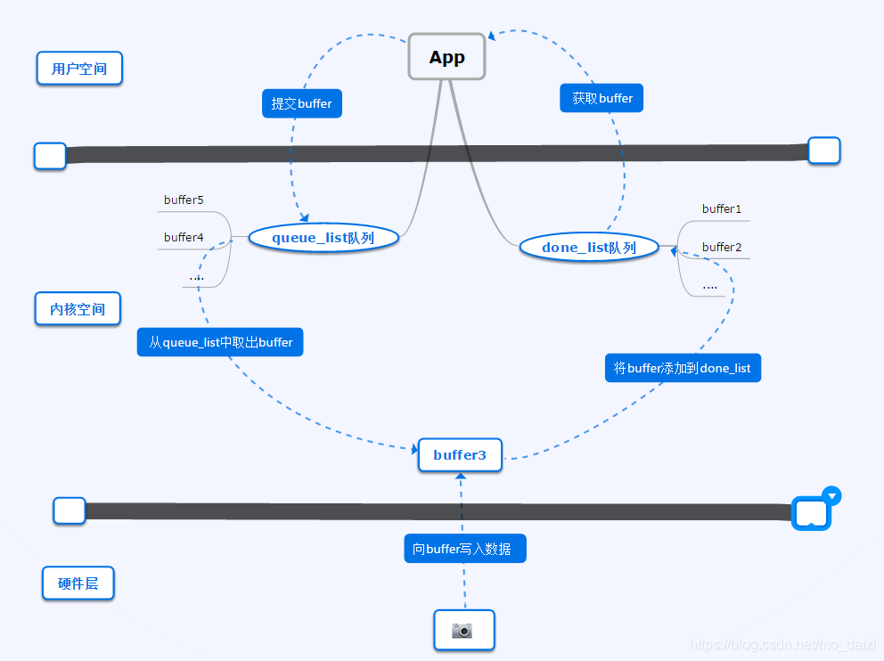
**buffer在内核空间申请,用户空间通过 mmap 函数映射到buffer**

V4L2驱动中会维护queue_list和done_list两个存储buffer指针的队列

- 用户空间app端会向内核申请已经写入新数据的buffer，内核空间驱动从done_list队列中返回buffer指针

- app得到buffer数据进行处理，处理完成后将buffer提交给内核，内核将app提交的buffer添加到queue_list队列中

- 内核驱动从queue_list队列中取出空闲的buffer，并写入最新的视频数据，当一帧数据更新完后，将该buffer加入到 done_list队列中等待app获取
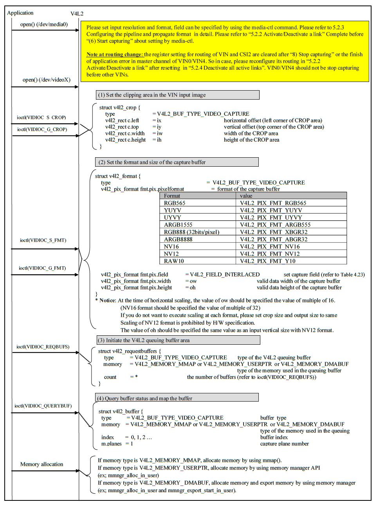
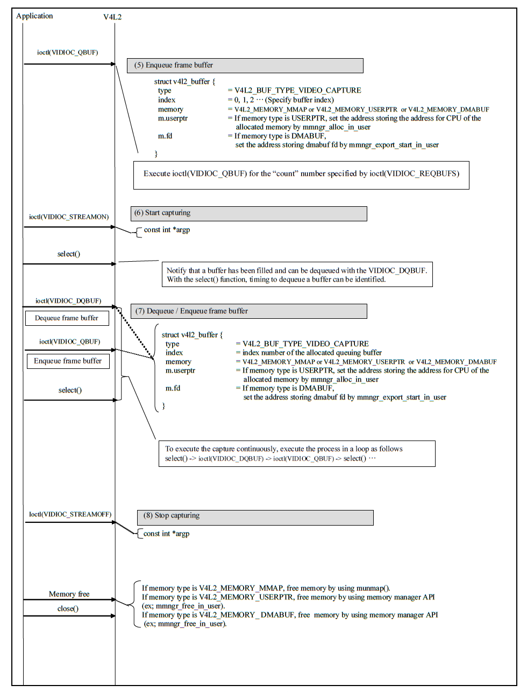

## V4L2驱动

### 常见的硬件拓扑结构

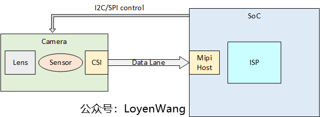

- 通常一个camera的模组如图所示，通常包括Lens、Sensor、CSI接口等，其中CSI接口用于视频数据的传输；
- SoC的Mipi接口对接Camera，并通过I2C/SPI控制camera模组；
- Camera模组中也可以包含ISP模块，用于对图像进行处理，有的SoC中也集成了ISP的IP，接收camera的raw数据后，进行图像处理；

### 数据结构

以v4l2_device和v4l2_subdev来进行抽象硬件,以v4l2_device来代表整个输入设备，以v4l2_subdev来代表子模块，比如CSI、Sensor等。
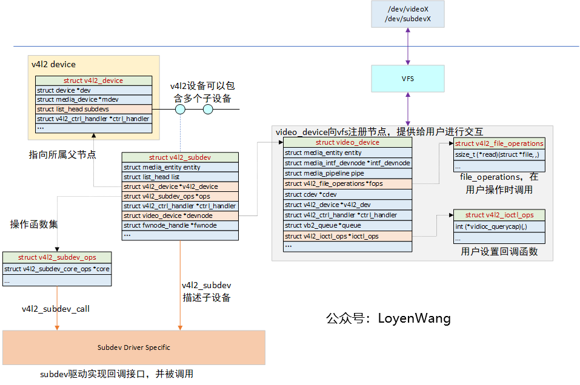

- **v4l2_device**：对视频设备的整体进行抽象，可以看成是一个纽带，将各个子设备联系在一起，通常它会嵌入在其他结构体中以提供v4l2框架的功能，比如strcut isp_device；
- **v4l2_subdev**：对子设备进行抽象，该结构体中包含的struct v4l2_subdev_ops是一个完备的操作函数集，用于对接各种不同的子设备，比如video、audio、sensor等，同时还有一个核心的函数集struct v4l2_subdev_core_ops，提供更通用的功能。子设备驱动根据设备特点实现该函数集中的某些函数即可；
- **video_device**：用于向系统注册字符设备节点，以便用户空间可以进行交互，包括各类设置以及数据buffer的获取等，在该结构体中也能看到struct v4l2_ioctl_ops和struct vb2_queue结构体字段，这些与上文中的应用层代码编写息息相关；
- 如果子设备不需要与应用层交互，struct v4l2_subdev中内嵌的video_device也可以不向系统注册字符设备；
- video_device结构体，可以内嵌在其他结构体中，以便提供用户层交互的功能，比如struct isp_video；
针对图中回调函数集，v4l2-core提供了一些实现，所以driver在实现时，非特殊情况下可以不用重复造轮子；

### 调用控制流程-控制流

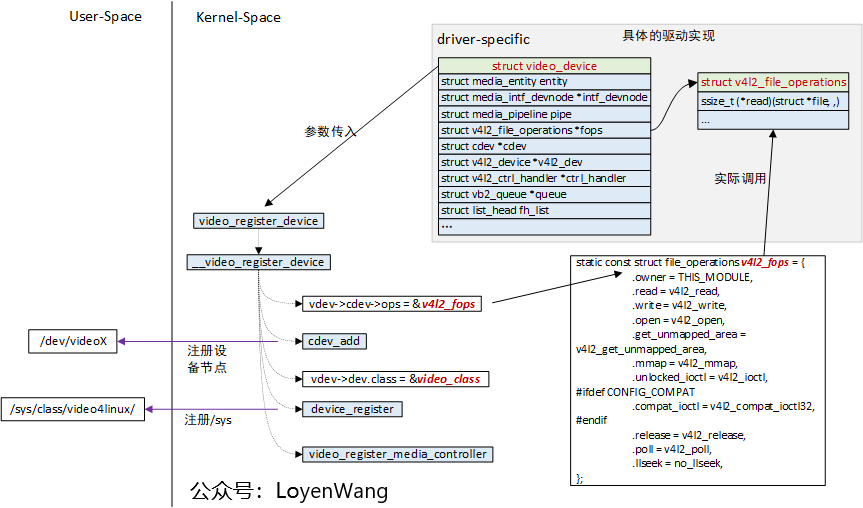

- 在驱动实现中，驱动结构体中内嵌**struct video_device**，同时实现struct v4l2_file_operations结构体中的函数，最终通过**video_register_device**向提供注册；
- v4l2_register_device函数通过**cdev_add**向系统注册字符设备，并指定了file_operations，用户空间调用**open/read/write/ioctl**等接口，便可回调到驱动实现中；
- v4l2_register_device函数中，通过**device_register**向系统注册设备，会在**/sys**文件系统下创建节点；

### 数据流

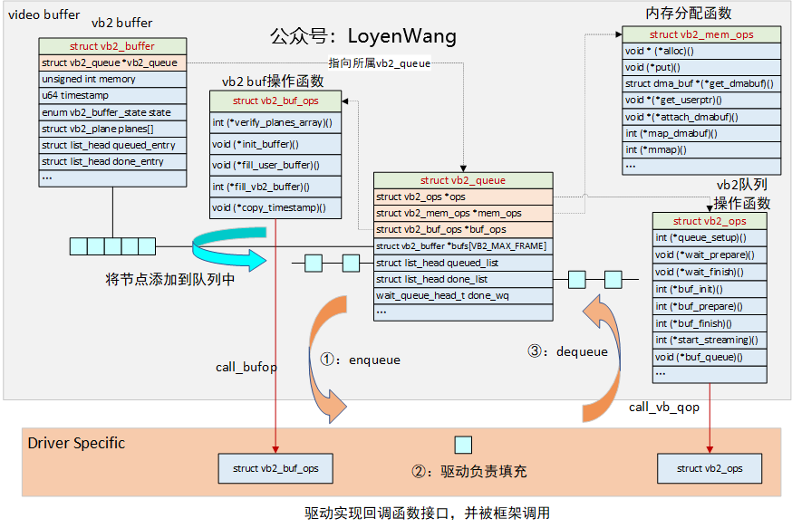

- **vb2_queue**：核心的数据结构，用于描述buffer的队列，其中struct vb2_buffer *bufs[]是存放buffer节点的数组，该数组中的成员代表了vb2 buffer，并将在queued_list和done_list两个队列中进行流转；
- **struct vb2_buf_ops**：buffer的操作函数集，由驱动来实现，并由框架通过call_bufop宏来对特定的函数进行调用；
- **struct vb2_mem_ops**：内存buffer分配函数接口，buffer类型分为三种：1）虚拟地址和物理地址都分散，可以通过dma-sg来完成；2）物理地址分散，虚拟地址连续，可以通过vmalloc分配；3）物理地址连续，可以通过dma-contig来完成；三种类型也vb2框架中都有实现，框架可以通过call_memop来进行调用；
- **struct vb2_ops**：vb2队列操作函数集，由驱动来实现对应的接口，并在框架中通过call_vb_qop宏被调用；

**Buffer申请**
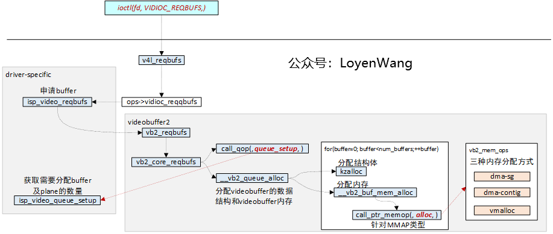
**Buffer_Enqueue**
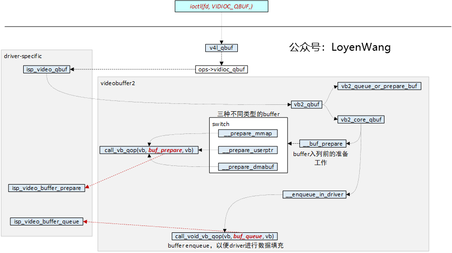
**Buffer_Dequeue**
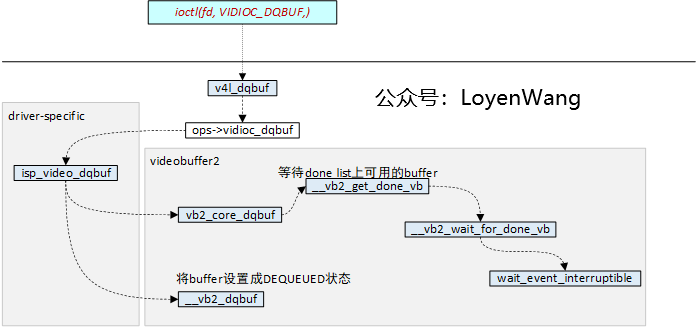
**Stream_on**
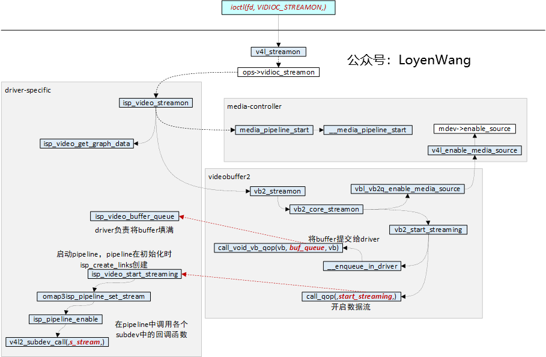

缓冲区管理涉及到内存分配、缓冲区映射、DMA 传输等复杂操作
数据传输通常涉及 DMA 操作，将数据从设备传输到缓冲区，然后从缓冲区传输到用户空间。这部分代码根据具体设备和需求会有很大差异

