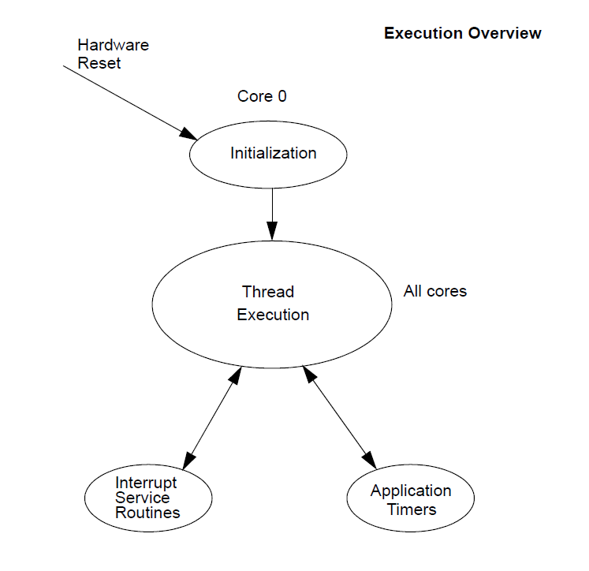
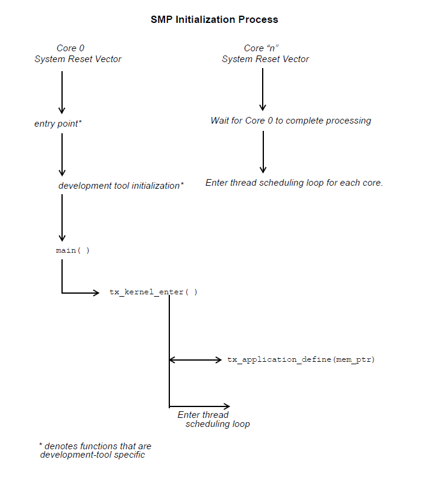

# ThreadX 文档
<!-- TOC -->

- [Threadx高效任务和中断处理速度](#threadx)
  - [1. 高效的内核设计](#1-)
  - [2. 优化的上下文切换](#2-)
  - [3. 高效的中断处理](#3-)
  - [4. 零延迟中断（ZLI）支持](#4-zli)
  - [5. 高效的数据结构](#5-)
  - [6. 汇编优化](#6-)
  - [7. 预先分配资源](#7-)
  - [8. 时间切片](#8-)

<!-- TOC END -->

[ThreadX文档](https://github.com/eclipse-threadx/rtos-docs)

## Threadx高效任务和中断处理速度

ThreadX通过多个技术优化和设计选择实现了高效的任务切换和中断处理速度。以下是其关键实现方式：

### 1. 高效的内核设计

ThreadX内核设计简洁高效，避免了不必要的开销。内核代码经过高度优化，以最小化执行路径和上下文切换时间。

### 2. 优化的上下文切换

最小化上下文保存: 在任务切换时，ThreadX只保存和恢复必要的寄存器，而不是整个CPU上下文。这减少了任务切换的开销。
快速的任务调度器: 调度器使用高效的数据结构和算法来快速确定下一个要运行的任务。

### 3. 高效的中断处理

直接中断处理: ThreadX允许中断处理程序直接调用内核服务，这样可以在中断上下文中完成更多的工作，减少中断处理的延迟。
中断优先级管理: 支持基于优先级的中断管理，确保高优先级中断能迅速响应，并且低优先级中断不会长时间阻塞高优先级中断。

### 4. 零延迟中断（ZLI）支持

ThreadX的零延迟中断模式允许一些高优先级的中断在完全独立于内核的情况下运行，避免了内核调度的开销。

### 5. 高效的数据结构

ThreadX使用优化的数据结构，如双向链表和优先级队列，来管理任务、定时器和其他内核对象。这些数据结构支持快速插入、删除和查找操作，提高了系统的整体性能。

### 6. 汇编优化

在关键路径上，ThreadX的代码使用了手工编写的汇编语言，以最大限度地提高性能。这些优化特别适用于任务切换和中断处理等时间关键的操作。

### 7. 预先分配资源

ThreadX在系统初始化时尽量预先分配和初始化资源，避免在运行时分配资源导致的延迟。这包括任务控制块（TCB）、信号量和队列等。

### 8. 时间切片

ThreadX支持时间切片调度，即使多个任务具有相同优先级，它们也能公平地分享CPU时间。时间切片机制经过优化，确保切换开销尽可能低。

实际应用效果
这些优化使ThreadX在各种嵌入式系统中表现出色，特别是在对实时性和高性能有严格要求的应用中，如工业控制、医疗设备和通信系统等。

总结
通过精简内核设计、优化上下文切换和中断处理路径、使用高效数据结构和手工优化的汇编代码，ThreadX实现了非常快的任务切换和中断处理速度。这些设计和实现细节共同确保了ThreadX在嵌入式系统中的高性能表现。

