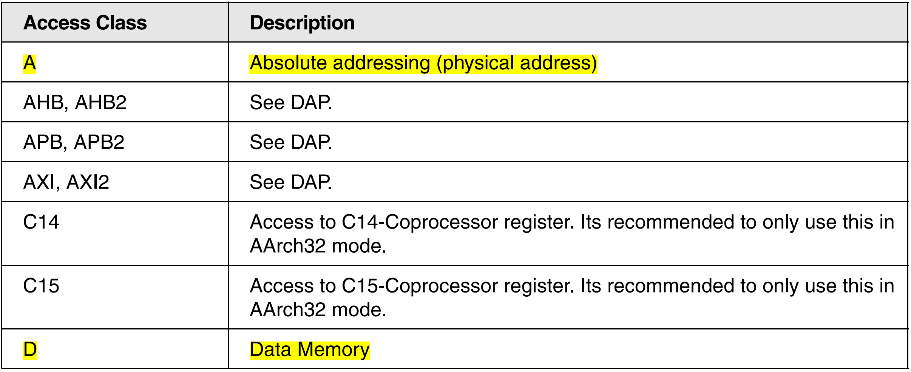
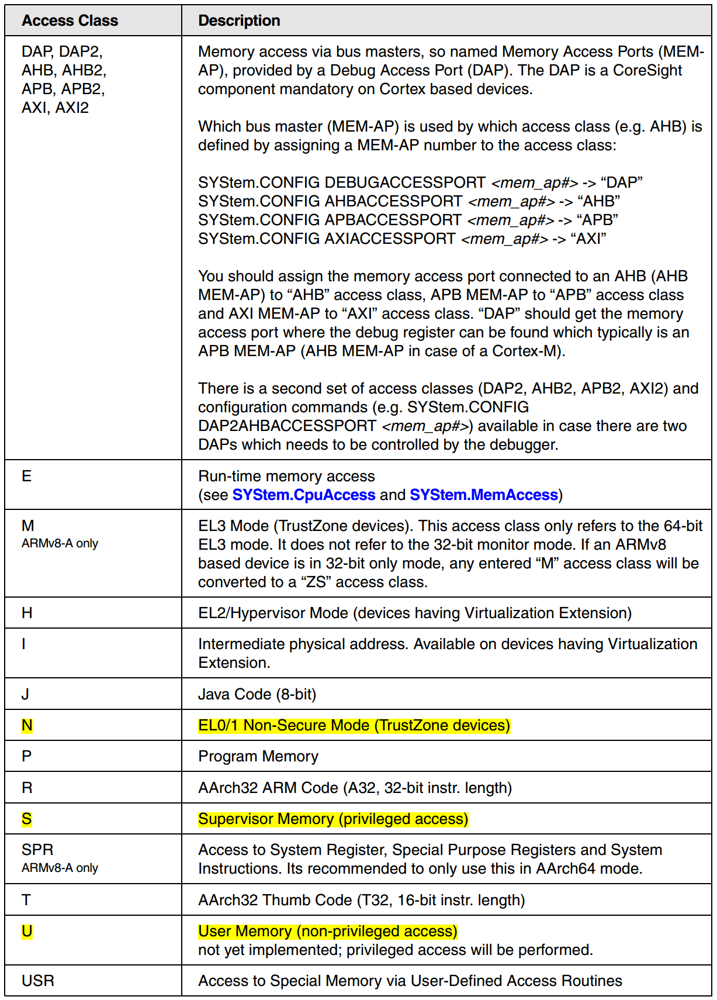
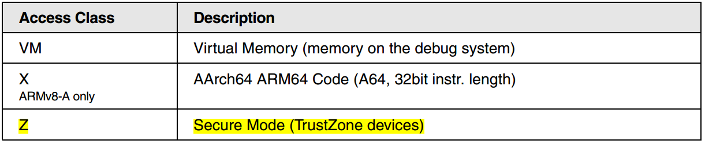
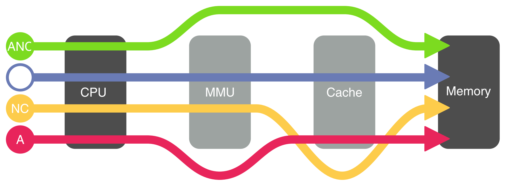

# 调试工具（三）：trace32

[调试工具（三）：trace32](https://www.dumpstack.cn/index.php/2022/02/25/398.html#37)

## Peripheral Files Programming

图中数字后的点表示是十进制

**HGROUP**: Define read-once/write GROUP
**RGROUP**: Define read-only GROUP
**WSGROUP**: Define write-only and shadow GROUP
**WGROUP**: Define write-only GROUP
**SGROUP**: Define sequence GROUP

**BITFLD**: bit
**HEXMASK**: Define bits for a hexadecimal display

**对齐**:AUTOINDENT.ON  LEFT/RIGHT/CENTER TREE/LINE

**BUTTON**: Define command button
**HIDE**: Define write-only line

per文件参数传递：

xxx.per AZNC:0x002D000000
per文件中：
ENTRY &TOP_CRU_Base=0x002D000000

BASE &TOP_CRU_Base

cmm中函数声明调用：

GOSUB fun_name "&input_param"
RETURNVALUES &out_value

fun_name
(
  PRIVATE &function_value
  PARAMETERS &input_param

  //add function

  RETURN "&function_value"
)

[Trace32内存访问](https://www.cnblogs.com/arnoldlu/p/17428690.html)

内存访问主体包含CPU、MMU，Cache三个。常见访问组合：

