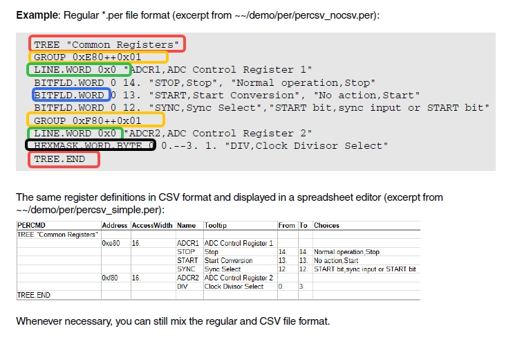
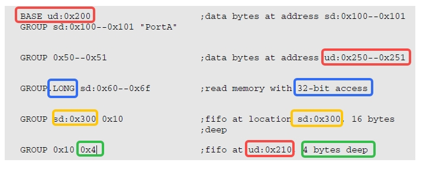

# 调试工具（三）：trace32

[调试工具（三）：trace32](https://www.dumpstack.cn/index.php/2022/02/25/398.html#37)

## Peripheral Files Programming

图中数字后的点表示是十进制

**HGROUP**: Define read-once/write GROUP
**RGROUP**: Define read-once GROUP
**WSGROUP**: Define write-only and shadow GROUP
**WGROUP**: Define write-only GROUP
**SGROUP**: Define sequence GROUP

**BITFLD**: bit
**HEXMASK**: Define bits for a hexadecimal display

**对齐**:AUTOINDENT.ON  LEFT/RIGHT/CENTER TREE/LINE

**BUTTON**: Define command button
**HIDE**: Define write-only line
