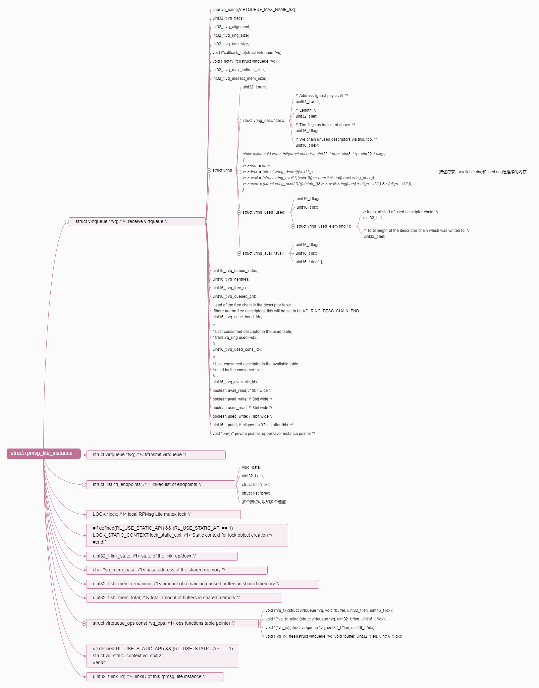

# RPMSG Lite
<!-- TOC -->

- [Usage](#usage)
- [Configuration options](#configuration-options)

<!-- TOC END -->


[RPMSG Lite](https://github.com/Shoukuan/rpmsg-lite)


## Usage

The application should put the /rpmsg_lite/lib/include directory to the include path and in the application, include either the rpmsg_lite.h header file, or optionally also include the rpmsg_queue.h and/or rpmsg_ns.h files. Both porting sublayers should be provided for you by NXP, but if you plan to use your own RTOS, all you need to do is to implement your own environment layer (in other words, rpmsg_env_myrtos.c) and to include it in the project build.

The initialization of the stack is done by calling the **rpmsg_lite_master_init()** on the master side and the **rpmsg_lite_remote_init()** on the remote side. This initialization function must be called prior to any RPMsg-Lite API call. After the init, it is wise to create a communication endpoint, otherwise communication is not possible. This can be done by calling the rpmsg_lite_create_ept() function. It optionally accepts a last argument, where an internal context of the endpoint is created, just in case the RL_USE_STATIC_API option is set to 1. If not, the stack internally calls env_alloc() to allocate dynamic memory for it. In case a callback-based receiving is to be used, an ISR-callback is registered to each new endpoint with user-defined callback data pointer. If a blocking receive is desired (in case of RTOS environment), the rpmsg_queue_create() function must be called before calling rpmsg_lite_create_ept(). The queue handle is passed to the endpoint creation function as a callback data argument and the callback function is set to rpmsg_queue_rx_cb(). Then, it is possible to use rpmsg_queue_receive() function to listen on a queue object for incoming messages. The rpmsg_lite_send() function is used to send messages to the other side.

The RPMsg-Lite also implements no-copy mechanisms for both sending and receiving operations. These methods require specifics that have to be considered when used in an application.

**no-copy-send mechanism**: This mechanism allows sending messages without the cost for copying data from the application buffer to the RPMsg/virtio buffer in the shared memory. The sequence of no-copy sending steps to be performed is as follows:

- Call the rpmsg_lite_alloc_tx_buffer() function to get the virtio buffer and provide the buffer pointer to the application.
Fill the data to be sent into the pre-allocated virtio buffer. Ensure that the filled data does not exceed the buffer size (provided as the rpmsg_lite_alloc_tx_buffer() size output parameter).
- Call the rpmsg_lite_send_nocopy() function to send the message to the destination endpoint. Consider the cache functionality and the virtio buffer alignment. See the rpmsg_lite_send_nocopy() function description below.

**no-copy-receive mechanism**: This mechanism allows reading messages without the cost for copying data from the virtio buffer in the shared memory to the application buffer. The sequence of no-copy receiving steps to be performed is as follows:

- Call the rpmsg_queue_recv_nocopy() function to get the virtio buffer pointer to the received data.
Read received data directly from the shared memory.
- Call the rpmsg_queue_nocopy_free() function to release the virtio buffer and to make it available for the next data transfer.
The user is responsible for destroying any RPMsg-Lite objects he has created in case of deinitialization. In order to do this, the function rpmsg_queue_destroy() is used to destroy a queue, rpmsg_lite_destroy_ept() is used to destroy an endpoint and finally, rpmsg_lite_deinit() is used to deinitialize the RPMsg-Lite intercore communication stack. Deinitialize all endpoints using a queue before deinitializing the queue. Otherwise, you are actively invalidating the used queue handle, which is not allowed. RPMsg-Lite does not check this internally, since its main aim is to be lightweight.


## Configuration options

The RPMsg-Lite can be configured at the compile time. The default configuration is defined in the rpmsg_default_config.h header file. This configuration can be customized by the user by including rpmsg_config.h file with custom settings. The following table summarizes all possible RPMsg-Lite configuration options.

| Configuration option         | Default value | Usage     |
|------------------------------|---------------|-----------|
|RL_MS_PER_INTERVAL            | (1)           | Delay in milliseconds used in non-blocking API functions for polling.      |
|RL_BUFFER_PAYLOAD_SIZE        | (496)         | **Size of the buffer payload, it must be equal to (240, 496, 1008, ...) [2^n - 16]**   |
|RL_BUFFER_COUNT               | (2)           | Number of the buffers, it must be power of two (2, 4, ...)      |
|RL_API_HAS_ZEROCOPY           | (1)           | Zero-copy API functions enabled/disabled.          |
|RL_USE_STATIC_API             | (0)           | Static API functions (no dynamic allocation) enabled/disabled.    |
|RL_CLEAR_USED_BUFFERS         | (0)           | Clearing used buffers before returning back to the pool of free buffers enabled/disabled.   |
|RL_USE_MCMGR_IPC_ISR_HANDLER  | (0)           | When enabled IPC interrupts are managed by the Multicore Manager (IPC interrupts router), when disabled RPMsg-Lite manages IPC interrupts by itself.   |
|RL_USE_ENVIRONMENT_CONTEXT    | (0)           | When enabled the environment layer uses its own context. Required for some environments (QNX). The default value is 0 (no context, saves some RAM).    |
|RL_DEBUG_CHECK_BUFFERS        | (0)           | When enabled buffer pointers passed to rpmsg_lite_send_nocopy() and rpmsg_lite_release_rx_buffer() functions (enabled by RL_API_HAS_ZEROCOPY config) are checked to avoid passing invalid buffer pointer. The default value is 0 (disabled). Do not use in RPMsg-Lite to Linux configuration.    |
|RL_ALLOW_CONSUMED_BUFFERS_NOTIFICATION        | (0)           | When enabled the opposite side is notified each time received buffers are consumed and put into the queue of available buffers. Enable this option in RPMsg-Lite to Linux configuration to allow unblocking of the Linux blocking send. The default value is 0 (RPMsg-Lite to RPMsg-Lite communication).    |
|RL_ALLOW_CUSTOM_SHMEM_CONFIG  | (0)           | It allows to define custom shared memory configuration and replacing the shared memory related global settings from rpmsg_config.h This is useful when multiple instances are running in parallel but different shared memory arrangement (vring size & alignment, buffers size & count) is required. The default value is 0 (all RPMsg_Lite instances use the same shared memory arrangement as defined by common config macros). |
|RL_ASSERT                     | see rpmsg_default_config.h | Assert implementation.    |



avialible ring 和 used ring初始化在函数rpmsg_lite_master_init 和rpmsg_lite_remote_init，参考如下：

```C
            if (vqs[j] == rpmsg_lite_dev->rvq)
            {
# if defined(RL_ALLOW_CUSTOM_SHMEM_CONFIG) && (RL_ALLOW_CUSTOM_SHMEM_CONFIG == 1)
                status =
                    virtqueue_fill_avail_buffers(vqs[j], buffer, (uint32_t)(shmem_config.buffer_payload_size + 16UL));
# else
                status = virtqueue_fill_avail_buffers(vqs[j], buffer, (uint32_t)RL_BUFFER_SIZE);
# endif /* defined(RL_ALLOW_CUSTOM_SHMEM_CONFIG) && (RL_ALLOW_CUSTOM_SHMEM_CONFIG == 1) */
            }
            else if (vqs[j] == rpmsg_lite_dev->tvq)
            {
# if defined(RL_ALLOW_CUSTOM_SHMEM_CONFIG) && (RL_ALLOW_CUSTOM_SHMEM_CONFIG == 1)
                status =
                    virtqueue_fill_used_buffers(vqs[j], buffer, (uint32_t)(shmem_config.buffer_payload_size + 16UL));
# else
                status = virtqueue_fill_used_buffers(vqs[j], buffer, (uint32_t)RL_BUFFER_SIZE);
# endif /* defined(RL_ALLOW_CUSTOM_SHMEM_CONFIG) && (RL_ALLOW_CUSTOM_SHMEM_CONFIG == 1) */
            }
            else
            {
                /* coco begin validated: this branch will never met unless RAM is corrupted */
            }
```

```C
/*!
 * virtqueue_fill_avail_buffers - Enqueues single buffer in vring, updates avail
 *
 * @param vq                    - Pointer to VirtIO queue control block
 * @param buffer                - Address of buffer
 * @param len                   - Length of buffer
 *
 * @return                      - Function status
 */
int32_t virtqueue_fill_avail_buffers(struct virtqueue *vq, void *buffer, uint32_t len);

struct vring_avail {
    uint16_t flags;        // 可用环标志，通常初始值为0
    uint16_t idx;          // 可用环中的索引，通常初始值为0,环中位置索引
    //以上两个元素可以称为环头

    uint16_t ring[QUEUE_SIZE];  // 索引数组，用于存储描述符在描述符环中的索引，存有带有数据的描述符在描述符表中的索引
    // 这里的 QUEUE_SIZE 可以根据具体的 Virtqueue 实现和需求进行设置
};
//在初始化可用环结构体时，通常会将 flags 和 idx 字段的初始值设置为零，并根据具体的需求和设计，可能会初始化 ring 数组中的元素。在实际使用中，idx 字段会被用来跟踪可用环中的下一个可用索引位置，而 ring 数组则用于存储描述符在描述符环中的索引。


 /* virtqueue_fill_used_buffers - Fill used buffer ring
 *
 * @param vq                     - Pointer to VirtIO queue control block
 * @param buffer                 - Buffer to add
 * @param len                    - Length of buffer
 *
 * @return                       - Function status
 */
int32_t virtqueue_fill_used_buffers(struct virtqueue *vq, void *buffer, uint32_t len);

/* uint32_t is used here for ids for padding reasons. */
struct vring_used_elem
{
    /* Index of start of used descriptor chain. */
    uint32_t id;
    /* Total length of the descriptor chain which was written to. */
    uint32_t len;
};

struct vring_used {
    uint16_t flags;        // 已用环标志，通常初始值为0
    uint16_t idx;          // 已用环中的索引，通常初始值为0
    //以上两个元素可以称为环头

    struct vring_used_elem ring[QUEUE_SIZE];  // 元素数组，用于存储已使用的描述符信息
    // 这里的 QUEUE_SIZE 可以根据具体的 Virtqueue 实现和需求进行设置
};
//在初始化已用环结构体时，通常会将 flags 和 idx 字段的初始值设置为零，并根据具体的需求和设计，可能会初始化 ring 数组中的元素。在实际使用中，idx 字段会被用来跟踪已用环中的下一个可用索引位置，而 ring 数组则用于存储已使用的描述符信息，通常是描述符的索引和长度。
```

