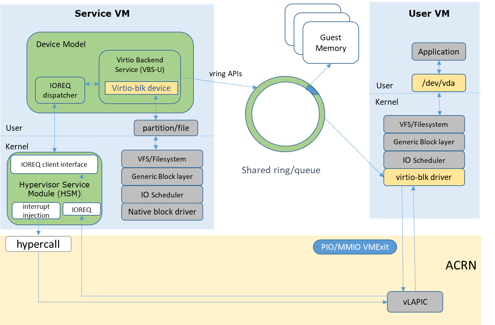
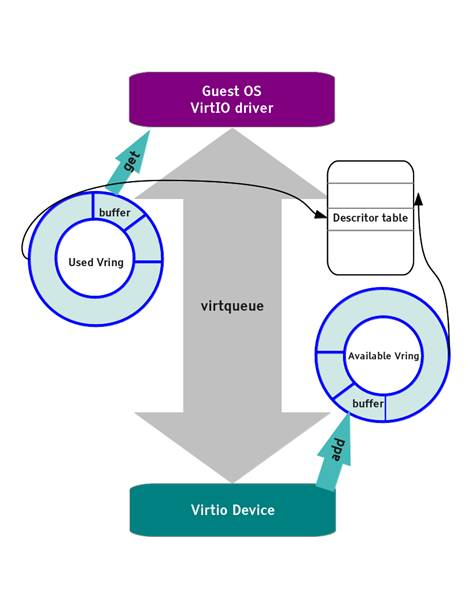
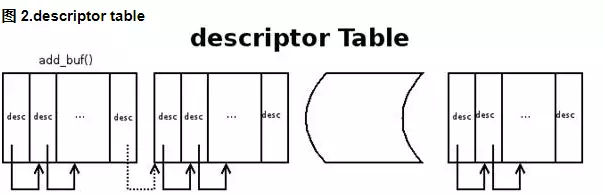
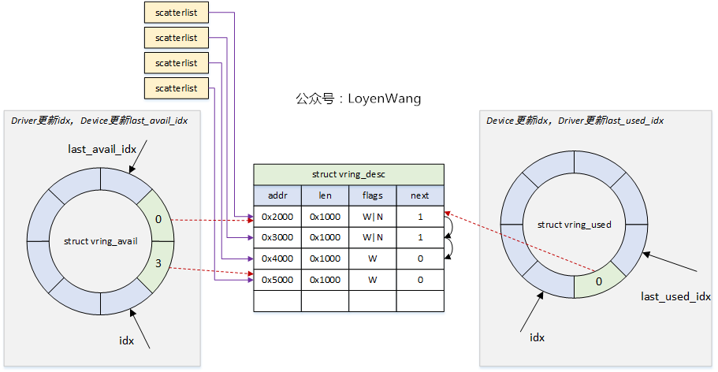
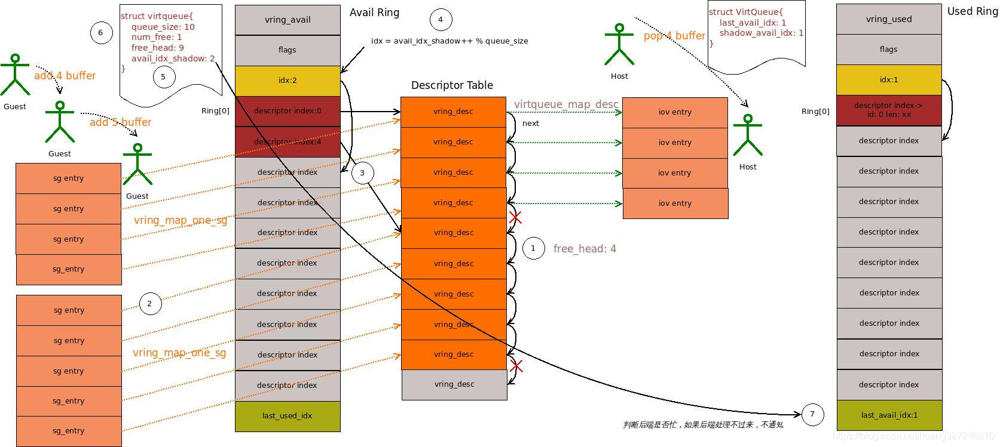
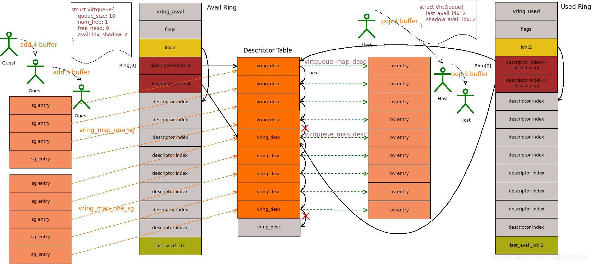

# Virtio 原理与实现

[Virtio 原理与实现](https://zhuanlan.zhihu.com/p/639301753)

  

vring 包含三个部分，描述符数组 desc，可用的 available ring 和使用过的 used ring。

**desc** 用于存储一些关联的描述符，每个描述符记录一个对 buffer 的描述，**available ring** 则用于 guest 端表示当前有**哪些描述符**是可用的
**used ring** 则表示 host 端**哪些描述符**已经被使用。

>**ring中存储的还是描述符**

  

当 guest 向 virtqueue 中写数据时，实际上是向 desc 结构指向的 buffer 中填充数据，完了会更新 available ring，然后再通知 host。

当 host 收到接收数据的通知时，首先从 desc 指向的 buffer 中找到 available ring 中添加的 buffer，映射内存，同时更新 used ring，并通知 guest 接收数据完毕。

> 申请或者预留一段共享内存，把共享内存划分成若干个固定大小的buffer，然后每块buffer由一个描述符记录，然后形成一个描述符表记录整块共享内存。另外有两个环形分别管理available描述符和used描述符。  
> 发送消息方从used ring中获取可用的共享内存buffer，填充消息，更新到available ring中，然后kick接收消息方。  
> 接收消息方从available ring中获取包含消息的描述符，处理消息，更新到used ring。

[virtqueue vring 的实现](https://blog.lomot.cn/2022/08/virtio-virtqueue-struct/)

[VirtIO实现原理——数据传输演示](https://blog.csdn.net/huang987246510/article/details/103708461#_2)

**针对上图的说明：**

- vring_avail可以理解为是由ring头：flags和idx，ring体：ring[]数组，ring尾：last_used_idx组成
- 因为是第二次添加buffer，所以vring_avail中idx的值由1变为2
- 第二次添加buffer的描述符index是从描述符表中的4，所以vring_avail中ring[idx]的值是4
- 因为第一次添加的buffer已经被使用，所以vring_avail中last_used_idx是1

- vring_used可以理解为是由ring头：flags和idx，ring体：ring[]数组，ring尾：last_avail_idx组成
- 因为是第二次处理buffer，所以vring_used中idx的值由1变为2
- 第二次处理buffer的描述符index是从描述符表中的4，所以vring_used中ring[idx]的index值是4，其中len为5
- 因为第二次的buffer已经被使用，所以vring_used中last_avail_idx是2
