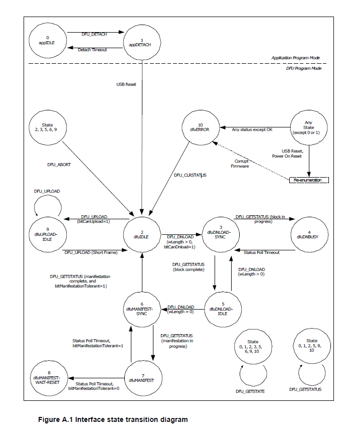

# DFU源码分析
<!-- TOC -->

- [Host端](#host)
  - [Download](#download)
  - [Upload](#upload)
- [Device端](#device)
  - [描述符](#)

<!-- TOC END -->




## Host端

### Download

```C
/* DFU_UPLOAD request for DfuSe 1.1a */
static int dfuse_upload(struct dfu_if *dif, const unsigned short length,
   unsigned char *data, unsigned short transaction)
{
 int status;

 status = libusb_control_transfer(dif->dev_handle,
   /* bmRequestType */  LIBUSB_ENDPOINT_IN |
      LIBUSB_REQUEST_TYPE_CLASS |
      LIBUSB_RECIPIENT_INTERFACE,
   /* bRequest      */  DFU_UPLOAD,
   /* wValue        */  transaction,
   /* wIndex        */  dif->interface,
   /* Data          */  data,
   /* wLength       */  length,
      DFU_TIMEOUT);
 if (status < 0) {
  warnx("dfuse_upload: libusb_control_transfer returned %d (%s)",
        status, libusb_error_name(status));
 }
 return status;
}

int dfuse_do_dnload(struct dfu_if *dif, int xfer_size, struct dfu_file *file,
      const char *dfuse_options)
{
 int ret;
 struct dfu_if *adif;

 if (dfuse_options)
  dfuse_parse_options(dfuse_options); //解析命令行输入的操作

 adif = dif;
 while (adif) {
  adif->mem_layout = parse_memory_layout((char *)adif->alt_name); //根据枚举过程中设备端回复的字符串描述符解析内存信息：起始地址，大小，访问类型
  if (!adif->mem_layout)
   errx(EX_IOERR,
        "Failed to parse memory layout for alternate interface %i",
        adif->altsetting);
  if (adif->quirks & QUIRK_DFUSE_LAYOUT)
   fixup_dfuse_layout(adif, &(adif->mem_layout));
  adif = adif->next;
 }

 if (dfuse_unprotect) {
  if (!dfuse_force) {
   errx(EX_USAGE, "The read unprotect command "
    "will erase the flash memory"
    "and can only be used with force\n");
  }
  ret = dfuse_special_command(dif, 0, READ_UNPROTECT);// 特殊命令
  printf("Device disconnects, erases flash and resets now\n");
  return ret;
 }
 if (dfuse_mass_erase) {
  if (!dfuse_force) {
   errx(EX_USAGE, "The mass erase command "
    "can only be used with force");
  }
  printf("Performing mass erase, this can take a moment\n");
  ret = dfuse_special_command(dif, 0, MASS_ERASE);
 }
 if (!file->name) {
  printf("DfuSe command mode\n");
  ret = 0;
 } else if (dfuse_address_present) {
  if (file->bcdDFU == 0x11a) {
   errx(EX_USAGE, "This is a DfuSe file, not "
    "meant for raw download");
  }
  ret = dfuse_do_bin_dnload(dif, xfer_size, file, dfuse_address); //下载bin
 } else {
  if (file->bcdDFU != 0x11a) {
   warnx("Only DfuSe file version 1.1a is supported");
   errx(EX_USAGE, "(for raw binary download, use the "
        "--dfuse-address option)");
  }
  ret = dfuse_do_dfuse_dnload(dif, xfer_size, file);//解析DfuSe文件并下载
 }

 adif = dif;
 while (adif) {
  free_segment_list(adif->mem_layout);
  adif = adif->next;
 }

 if (!dfuse_will_reset) {
  dfu_abort_to_idle(dif);
 }

 if (dfuse_leave)
  dfuse_do_leave(dif);

 return ret;
}

```

### Upload

```C

/* DFU_UPLOAD request for DfuSe 1.1a */
static int dfuse_upload(struct dfu_if *dif, const unsigned short length,
   unsigned char *data, unsigned short transaction)
{
 int status;

 status = libusb_control_transfer(dif->dev_handle,
   /* bmRequestType */  LIBUSB_ENDPOINT_IN |
      LIBUSB_REQUEST_TYPE_CLASS |
      LIBUSB_RECIPIENT_INTERFACE,
   /* bRequest      */  DFU_UPLOAD,
   /* wValue        */  transaction,
   /* wIndex        */  dif->interface,
   /* Data          */  data,
   /* wLength       */  length,
      DFU_TIMEOUT);
 if (status < 0) {
  warnx("dfuse_upload: libusb_control_transfer returned %d (%s)",
        status, libusb_error_name(status));
 }
 return status;
}
int dfuse_do_upload(struct dfu_if *dif, int xfer_size, int fd,
      const char *dfuse_options)
{
 int total_bytes = 0;
 int upload_limit = 0;
 unsigned char *buf;
 int transaction;
 int ret;

 buf = dfu_malloc(xfer_size);

 if (dfuse_options)
  dfuse_parse_options(dfuse_options);//解析命令行输入的操作
 if (dfuse_length)
  upload_limit = dfuse_length;
 if (dfuse_address_present) {
  struct memsegment *mem_layout, *segment;

  mem_layout = parse_memory_layout((char *)dif->alt_name);//根据枚举过程中设备端回复的字符串描述符解析内存信息：起始地址，大小，访问类型
  if (!mem_layout)
   errx(EX_IOERR, "Failed to parse memory layout");
  if (dif->quirks & QUIRK_DFUSE_LAYOUT)
   fixup_dfuse_layout(dif, &mem_layout);

  segment = find_segment(mem_layout, dfuse_address);//查找对应的内存段
  if (!dfuse_force &&
      (!segment || !(segment->memtype & DFUSE_READABLE)))
   errx(EX_USAGE, "Page at 0x%08x is not readable",
    dfuse_address);

  if (!upload_limit) {
   if (segment) {
    upload_limit = segment->end - dfuse_address + 1;
    printf("Limiting upload to end of memory segment, "
           "%i bytes\n", upload_limit);
   } else {
    /* unknown segment - i.e. "force" has been used */
    upload_limit = 0x4000;
    printf("Limiting upload to %i bytes\n", upload_limit);
   }
  }
  dfuse_special_command(dif, dfuse_address, SET_ADDRESS);// 特殊命令
  dfu_abort_to_idle(dif);
 } else {
  /* Boot loader decides the start address, unknown to us */
  /* Use a short length to lower risk of running out of bounds */
  if (!upload_limit) {
   warnx("Unbound upload not supported on DfuSe devices");
   upload_limit = 0x4000;
  }
  printf("Limiting default upload to %i bytes\n", upload_limit);
 }

 dfu_progress_bar("Upload", 0, 1);

 transaction = 2;
 while (1) {
  int rc;

  /* last chunk can be smaller than original xfer_size */
  if (upload_limit - total_bytes < xfer_size)
   xfer_size = upload_limit - total_bytes;
  rc = dfuse_upload(dif, xfer_size, buf, transaction++);// Upload 数据
  if (rc < 0) {
   ret = rc;
   goto out_free;
  }

  dfu_file_write_crc(fd, 0, buf, rc);
  total_bytes += rc;

  if (total_bytes < 0)
   errx(EX_SOFTWARE, "Received too many bytes");

  if (rc < xfer_size || total_bytes >= upload_limit) {
   /* last block, return successfully */
   ret = 0;
   break;
  }
  dfu_progress_bar("Upload", total_bytes, upload_limit);
 }

 dfu_progress_bar("Upload", total_bytes, total_bytes);

 dfu_abort_to_idle(dif);
 if (dfuse_leave)
  dfuse_do_leave(dif);

 out_free:
 free(buf);

 return ret;
}


```

## Device端

### 描述符

DFU设备描述符示例

1.标准设备描述符

```C
const uint8_t DFU_DeviceDescriptor[] = {
    0x12,                   // bLength
    0x01,                   // bDescriptorType (Device)
    0x00, 0x02,             // bcdUSB 2.00
    0x00,                   // bDeviceClass (Use class information in the Interface Descriptors)
    0x00,                   // bDeviceSubClass
    0x00,                   // bDeviceProtocol
    0x40,                   // bMaxPacketSize0 64
    0x83, 0x04,             // idVendor (Example: 0x0483)
    0x50, 0x57,             // idProduct (Example: 0x5750)
    0x00, 0x01,             // bcdDevice 1.00
    0x01,                   // iManufacturer (String Index)
    0x02,                   // iProduct (String Index)
    0x03,                   // iSerialNumber (String Index)
    0x01                    // bNumConfigurations
};
```

2.配置描述符

```C
const uint8_t DFU_ConfigDescriptor[] = {
    // Configuration Descriptor
    0x09,                   // bLength
    0x02,                   // bDescriptorType (Configuration)
    0x1B, 0x00,             // wTotalLength 27
    0x01,                   // bNumInterfaces 1
    0x01,                   // bConfigurationValue
    0x00,                   // iConfiguration (String Index)
    0x80,                   // bmAttributes (Bus Powered)
    0x32,                   // bMaxPower 100mA

    // Interface Descriptor
    0x09,                   // bLength
    0x04,                   // bDescriptorType (Interface)
    0x00,                   // bInterfaceNumber 0
    0x00,                   // bAlternateSetting
    0x00,                   // bNumEndpoints 0
    0xFE,                   // bInterfaceClass (Application Specific Interface)
    0x01,                   // bInterfaceSubClass (Device Firmware Upgrade)
    0x01,                   // bInterfaceProtocol (Runtime DFU)
    0x00,                   // iInterface (String Index)

    // DFU Functional Descriptor
    0x09,                   // bLength
    0x21,                   // bDescriptorType (DFU Functional)
    0x0B,                   // bmAttributes (bitWillDetach | bitManifestationTolerant)
    0xFF, 0x00,             // wDetachTimeOut 255 ms
    0x00, 0x04,             // wTransferSize 1024 bytes
    0x10, 0x01              // bcdDFUVersion 1.1
};
```

3.字符串描述符  

```C
const uint8_t DFU_StringDescriptor[] = {
    // String Descriptor 0 (Language)
    0x04,                   // bLength
    0x03,                   // bDescriptorType (String)
    0x09, 0x04,             // wLANGID (US English)

    // String Descriptor 1 (Manufacturer)
    0x0E,                   // bLength
    0x03,                   // bDescriptorType (String)
    'E', 0x00, 'x', 0x00, 'a', 0x00, 'm', 0x00, 'p', 0x00, 'l', 0x00, 'e', 0x00,

    // String Descriptor 2 (Product)
    0x10,                   // bLength
    0x03,                   // bDescriptorType (String)
    'D', 0x00, 'F', 0x00, 'U', 0x00, ' ', 0x00, 'D', 0x00, 'e', 0x00, 'v', 0x00, 'i', 0x00, 'c', 0x00, 'e', 0x00,

    // String Descriptor 3 (Serial Number)
    0x1A,                   // bLength
    0x03,                   // bDescriptorType (String)
    '0', 0x00, '1', 0x00, '2', 0x00, '3', 0x00, '4', 0x00, '5', 0x00, '6', 0x00, '7', 0x00, '8', 0x00, '9', 0x00, 'A', 0x00, 'B', 0x00, 'C', 0x00
};
```

解释
标准设备描述符：定义设备的基本信息，如USB版本、设备类、厂商ID、产品ID等。
配置描述符：定义设备的配置，包括接口描述符和DFU功能描述符。
字符串描述符：提供设备的字符串信息，如语言、厂商名称、产品名称和序列号。

