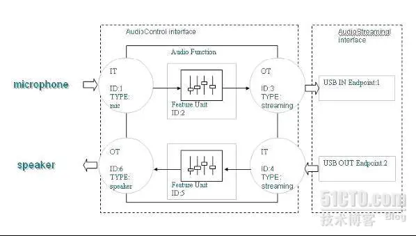
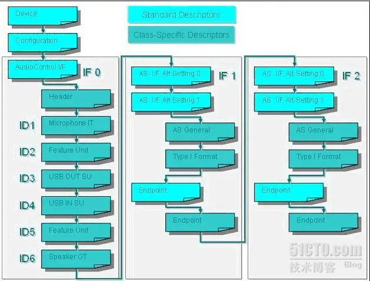

# USB描述符

USB描述符是USB设备用来向主机描述自身特性的数据结构。USB描述符有多种类型，包括设备描述符、配置描述符、接口描述符、端点描述符、字符串描述符等。

## 主要USB描述符类型

设备描述符（Device Descriptor）
配置描述符（Configuration Descriptor）
接口描述符（Interface Descriptor）
端点描述符（Endpoint Descriptor）
字符串描述符（String Descriptor）
设备描述符（Device Descriptor）
设备描述符包含设备的基本信息，如USB版本、厂商ID、产品ID等。

```C
struct usb_device_descriptor {
    uint8_t bLength;            // 设备描述符的长度
    uint8_t bDescriptorType;    // 设备描述符类型（值为1）
    uint16_t bcdUSB;            // 支持的USB规范版本
    uint8_t bDeviceClass;       // 设备类别代码
    uint8_t bDeviceSubClass;    // 设备子类别代码
    uint8_t bDeviceProtocol;    // 设备协议代码
    uint8_t bMaxPacketSize0;    // 端点0的最大包大小
    uint16_t idVendor;          // 厂商ID
    uint16_t idProduct;         // 产品ID
    uint16_t bcdDevice;         // 设备版本编号
    uint8_t iManufacturer;      // 描述制造商的字符串描述符的索引
    uint8_t iProduct;           // 描述产品的字符串描述符的索引
    uint8_t iSerialNumber;      // 描述设备序列号的字符串描述符的索引
    uint8_t bNumConfigurations; // 设备支持的配置数量
};
```

### 配置描述符（Configuration Descriptor）

配置描述符描述一个设备的具体配置，包括接口和端点。

```C
struct usb_config_descriptor {
    uint8_t bLength;              // 配置描述符的长度
    uint8_t bDescriptorType;      // 配置描述符类型（值为2）
    uint16_t wTotalLength;        // 包含所有接口和端点描述符的总长度
    uint8_t bNumInterfaces;       // 该配置支持的接口数量
    uint8_t bConfigurationValue;  // 该配置的编号
    uint8_t iConfiguration;       // 描述该配置的字符串描述符的索引
    uint8_t bmAttributes;         // 配置特性
    uint8_t bMaxPower;            // 该配置下设备的最大功耗
};
```

### 接口描述符（Interface Descriptor）

接口描述符描述配置中的一个接口，包括接口的类、子类和协议等。

```C
struct usb_interface_descriptor {
    uint8_t bLength;              // 接口描述符的长度
    uint8_t bDescriptorType;      // 接口描述符类型（值为4）
    uint8_t bInterfaceNumber;     // 接口编号
    uint8_t bAlternateSetting;    // 备用设置编号
    uint8_t bNumEndpoints;        // 该接口使用的端点数量
    uint8_t bInterfaceClass;      // 接口类别代码
    uint8_t bInterfaceSubClass;   // 接口子类别代码
    uint8_t bInterfaceProtocol;   // 接口协议代码
    uint8_t iInterface;           // 描述该接口的字符串描述符的索引
};
```

### 端点描述符（Endpoint Descriptor）

端点描述符描述接口使用的端点，包括端点地址、属性、最大包大小和轮询间隔等。

```C
struct usb_endpoint_descriptor {
    uint8_t bLength;            // 端点描述符的长度
    uint8_t bDescriptorType;    // 端点描述符类型（值为5）
    uint8_t bEndpointAddress;   // 端点地址
    uint8_t bmAttributes;       // 端点属性
    uint16_t wMaxPacketSize;    // 端点的最大包大小
    uint8_t bInterval;          // 轮询间隔（适用于中断和同步端点）
};
```

### 字符串描述符（String Descriptor）

字符串描述符用于描述设备的字符串信息，如制造商、产品名称和序列号。

```C
struct usb_string_descriptor {
    uint8_t bLength;            // 字符串描述符的长度
    uint8_t bDescriptorType;    // 字符串描述符类型（值为3）
    uint16_t wLANGID[];         // UTF-16LE编码的字符串
};
```

### 完整的描述符集合

以下是一个包含设备描述符、配置描述符、接口描述符和端点描述符的示例。

```C
// 设备描述符
const uint8_t DeviceDescriptor[] = {
    0x12,                   // bLength
    0x01,                   // bDescriptorType
    0x00, 0x02,             // bcdUSB
    0x00,                   // bDeviceClass
    0x00,                   // bDeviceSubClass
    0x00,                   // bDeviceProtocol
    0x40,                   // bMaxPacketSize0
    0x83, 0x04,             // idVendor
    0x50, 0x57,             // idProduct
    0x00, 0x01,             // bcdDevice
    0x01,                   // iManufacturer
    0x02,                   // iProduct
    0x03,                   // iSerialNumber
    0x01                    // bNumConfigurations
};

// 配置描述符
const uint8_t ConfigDescriptor[] = {
    0x09,                   // bLength
    0x02,                   // bDescriptorType
    0x22, 0x00,             // wTotalLength
    0x01,                   // bNumInterfaces
    0x01,                   // bConfigurationValue
    0x00,                   // iConfiguration
    0x80,                   // bmAttributes
    0x32,                   // bMaxPower

    // 接口描述符
    0x09,                   // bLength
    0x04,                   // bDescriptorType
    0x00,                   // bInterfaceNumber
    0x00,                   // bAlternateSetting
    0x01,                   // bNumEndpoints
    0xFF,                   // bInterfaceClass
    0x00,                   // bInterfaceSubClass
    0x00,                   // bInterfaceProtocol
    0x00,                   // iInterface

    // 端点描述符
    0x07,                   // bLength
    0x05,                   // bDescriptorType
    0x81,                   // bEndpointAddress
    0x02,                   // bmAttributes
    0x40, 0x00,             // wMaxPacketSize
    0x00                    // bInterval
};

// 字符串描述符
const uint8_t StringDescriptor0[] = {
    0x04,                   // bLength
    0x03,                   // bDescriptorType
    0x09, 0x04              // wLANGID
};

const uint8_t StringDescriptor1[] = {
    0x0E,                   // bLength
    0x03,                   // bDescriptorType
    'E', 0x00, 'x', 0x00, 'a', 0x00, 'm', 0x00, 'p', 0x00, 'l', 0x00, 'e', 0x00
};

const uint8_t StringDescriptor2[] = {
    0x10,                   // bLength
    0x03,                   // bDescriptorType
    'D', 0x00, 'F', 0x00, 'U', 0x00, ' ', 0x00, 'D', 0x00, 'e', 0x00, 'v', 0x00, 'i', 0x00, 'c', 0x00, 'e', 0x00
};

const uint8_t StringDescriptor3[] = {
    0x1A,                   // bLength
    0x03,                   // bDescriptorType
    '1', 0x00, '2', 0x00, '3', 0x00, '4', 0x00, '5', 0x00, '6', 0x00, '7', 0x00, '8', 0x00, '9', 0x00, 'A', 0x00, 'B', 0x00, 'C', 0x00
};

// 字符串描述符数组
const uint8_t* const StringDescriptors[] = {
    StringDescriptor0,
    StringDescriptor1,
    StringDescriptor2,
    StringDescriptor3
};
```

这些描述符定义了一个简单的USB设备，该设备具有一个配置，一个接口和一个端点。主机可以使用这些描述符来识别和与USB设备进行通信。

## USB声卡描述符

```C
const unsigned char Demo_DeviceDescriptor[] =

{

//Device:USB1.10,Vid=0x0435,Pid=0x2430,bNumConfigurations= 0x01,

0x12,//Length

0x01,//DescriptorType

0x10,

0x01,//bcdUSB

0x00,//DeviceClass

0x00,//DeviceSubClass

0x00,//DeviceProtocol

0x08,//bMaxPacketSize8

0x35,

0x04,//idVendor........

0x30,

0x24,//idProduct........

0x01,

0x00,//bcdDevice

1,//iManufacturer

2,//iProduct

3,//iSerialNumber

0x01//bNumConfigurations

};


/* USB Configuration Descriptor */

/*All Descriptors (Configuration,Interface, Endpoint, Class, Vendor */

const unsigned char Demo_ConfigDescriptor[] =

{

//Configuration:wTotalLength =0x00be,NumInterfaces = 0x03,

0x09,//Length

0x02,//DescriptorType: ConfigDescriptor

0xbe,

0x00,//TotalLength:0x00be

0x03,//NumInterfaces:3

0x01,//ConfigurationValue

0x00,//ConfigurationString

0x80,//Attributes:BusPower

0xfa,//MaxPower =0xfa*2ma


//standard interface ACdescriptor(Interface 0, Alternate Setting 0):

//bNumEndpoints =0x00,bInterFaceClass = 0x01(audio),bInterfaceSubClass = 0x01(audio ctl),

0x09,//Length

0x04,//DescriptorType:Inerface

0x00,//InterfaceNum:0

0x00, //AlternateSetting:0

0x00,//NumEndpoint:0

0x01,//InterfaceClass:audio

0x01,//InterfaceSubClass:audioctl

0x00,//InterfaceProtocol

0x00,//InterfaceString


//class-specific AC interfacedescriptor,audio interface(0x24),audio control header(0x01),

//Total Length 0x0048,Number ofstreaming interface 2,interfaceNr 2,1

0x0a,//Length

0x24,//DescriptorType:audiointerface descriptor

0x01,//DescriptorSubType:audiocontrol header

0x00,

0x01,//bcdADC:audio Device Class v1.00

0x48,

0x00,//TotalLength:0x0048

0x02,//InCollection:2AudioStreaming interface

0x02,//InterfaceNr(2)- AS #1 id AudioStreaming interface 2 belongs to this AudioControlinterface

0x01,//InterfaceNr(1)- AS #2 id AudioStreaming interface 1 belongs to this AudioControlinterface


//USB Microphone IT:audiointerface descriptor,audio control input terminal(0x02),terminal id 0x01,

//Microphone(0x0201),InputTerminal(0x02),2 channel:Left Front,Right Front

0x0c,//Length

0x24,//DescriptorType:audiointerface descriptor

0x02,//DescriptorSubType:InputTerminal

0x01,//TerminalID:0x01

0x01,

0x02,//TerminalType:USB Microphone

0x00,//AssocTerminal

0x02,//NrChannels:2channel

0x03,

0x00,//ChannelConfig:Left Front,Right Front,

0x00,//ChannelNameString

0x00,//TerminalString


//Audio Feature UnitDescriptor:audio interface descriptor,feature_unit(0x06),terminal id 0x02,

//SourceId 0x01,ControlSize0x01,Mute,Volume,

0x0a,//Length

0x24,//DescriptorType:audiointerface descriptor

0x06,//DescriptorSubType:AudioFeature Unit

0x02,//UnitID:0x02

0x01,//SourceID:1#Microphone IT

0x01,//ControlSize:1byte

0x01,//Controls:Mute

0x02,//Controls(0):Volume

0x02,//Controls(1):Volume

0x00,//Feature String


//USB Streaming OT:audiointerface descriptor,audio control output terminal(0x03),terminal id 0x03,

//USB Streaming(0x0101),OutputTerminal(0x03),SourceId 0x02,

0x09,//Length

0x24,//DescriptorType:audiointerface descriptor

0x03,//DescriptorSubTYpe:OutputTerminal

0x03,//TerminalID:0x03

0x01,

0x01,//TerminalType:USB Streaming

0x00,//AssocTerminal:ID0

0x02,//SourceID:2#Feature UNIT

0x00,//TerminalString


//USB USB Streaming IT:audiointerface descriptor,audio control input terminal(0x02),terminal id 0x04,

//USB Streaming(0x0101),InputTerminal(0x02),2 channel:Left Front,Right Front

0x0c,//Length

0x24,//DescriptorType:audiointerface descriptor

0x02,//DescriptorSubType:InputTerminal

0x04,//TerminalID:0x04

0x01,

0x01,//TerminalType:USB Streaming

0x00,//AssocTerminal

0x02,//NrChannels:2channel

0x03,

0x00,//ChannelConfig:Left Front,Right Front,

0x00,//ChannelNameString

0x00,//TerminalString


//Audio Feature UnitDescriptor:audio interface descriptor,feature_unit(0x06),terminal id 0x05,

//SourceId 0x04,ControlSize0x01,Mute,Volume,

0x0a,//Length

0x24,//DescriptorType:audiointerface descriptor

0x06,//DescriptorSubType:AudioFeature Unit

0x05,//UnitID:0x05

0x04,//SourceID:4 #USBStreaming IT

0x01,//ControlSize:1byte

0x01,//Controls:Mute,

0x02,//Controls(0):Volume

0x02,//Controls(1):Volume

0x00,//FeatureString


//USB Speaker OT:audio interfacedescriptor,audio control output terminal(0x03),terminal id 0x06,

//USB Speaker(0x0301),OutputTerminal(0x03),SourceId 0x05,

0x09,//Length

0x24,//DescriptorType:audiointerface descriptor

0x03,//DescriptorSubTYpe:OutputTerminal

0x06,//TerminalID:0x06

0x01,

0x03,//TerminalType:Speaker

0x00,//AssocTerminal:

0x05,//SourceID:5#Feature UNIT

0x00,//Terminal String


//-------------------Microphoneinterface---------------------//

//standardinterface AS descriptor(Interface 1, Alternate Setting 0):

//bNumEndpoints =0x00,bInterFaceClass = 0x01(audio),bInterfaceSubClass = 0x02(audiostream),

0x09,//Length

0x04,//DescriptorType:Interface

0x01,//InterfaceNum:1

0x00,//AlternateSetting:0

0x00,//NumEndpoint:0

0x01,//InterfaceClass:audio

0x02,//InterfaceSubClass:audiostreaming

0x00,//InterfaceProtocol

0x00,//InterfaceString


//standard interface ASdescriptor(Interface 1, Alternate Setting 1):

//bNumEndpoints = 0x01,bInterFaceClass = 0x01(audio),bInterfaceSubClass= 0x02(audio stream),

0x09,//Length

0x04,//DescriptorType:Interface

0x01,//InterfaceNum:1

0x01,//AlternateSetting:1

0x01,//NumEndpoint:1

0x01,//InterfaceClass:audio

0x02,//InterfaceSubClass:audiostreaming

0x00,//InterfaceProtocol

0x00,//Interface String


//Audio Streaming InterfaceDescriptor:AS_GENERAL(0x01),

//TerminalLink 0x03,PCM(0x0001)

0x07,//Length

0x24,//DescriptorType:audiointerface descriptor

0x01,//DescriptorSubType:AS_GENERAL

0x03,//TerminalLink:#3USBUSB Streaming OT

0x01,//Delay:1

0x01,

0x00,//FormatTag:PCM


//Type 1 Format typedescriptor:FORMAT_TYPE(0x02),FORMAT_TYPE_I(0x01),

//physical channels 0x02,twobyte per audio subframe(0x02),16bit,  音频格式配置

//32K(0x007d00)

0x0b,//Length

0x24,//DescriptorType:audiointerface descriptor

0x02,//DescriptorSubType:Format_type

0x01,//FormatType:Formattype 1

0x02,//NumberOfChannel:2

0x02,//SubframeSize:2byte

0x10,//BitsResolution:16bit

0x01,//SampleFreqType:Onesampling frequency.

0x00,

0x7d,

0x00,//32K(0x007d00)


//Endpoint 1 - StandardDescriptor:Input Endpoint1

//Isochronous,SynchronizationType(Asynchronous),MaxPacketSize 0x0084,

0x07,//Length

0x05,//DescriptorType:endpointdescriptor

0x81,//EndpointAddress:Inputendpoint 1

0x05,//Attributes:0x05,Isochronous,SynchronizationType(Asynchronous).........

0x84,

0x00,//MaxPacketSize:0x0084=........和音频格式有关

0x01,//Interval


//Endpoint - Audio StreamingDescriptor:

//Audio Endpointdescriptor,General,

0x07,//Length

0x25,//DescriptorType:audioendpoint descriptor

0x01,//DescriptorSubType:audioendpiont general

0x00,//Attributes:0x00........

0x00,//LockDelayUnits

0x00,

0x00,//LockDelay


//-------------------Speakerinterface---------------------//

//standard interfaceAS descriptor(Interface 2, Alternate Setting 0):

//bNumEndpoints =0x00,bInterFaceClass = 0x01(audio),bInterfaceSubClass = 0x02(audio stream),

0x09,//Length

0x04,//DescriptorType:Interface

0x02,//InterfaceNum:2

0x00,//AlternateSetting:0

0x00,//NumEndpoint:0

0x01,//InterfaceClass:audio

0x02,//InterfaceSubClass:audiostreaming

0x00,//InterfaceProtocol

0x00,//InterfaceString


//standard interface ASdescriptor(Interface 2, Alternate Setting 1):

//bNumEndpoints =0x01,bInterFaceClass = 0x01(audio),bInterfaceSubClass = 0x02(audio stream),

0x09,//Length

0x04,//DescriptorType:Interface

0x02,//InterfaceNum:2

0x01,//AlternateSetting:1

0x01,//NumEndpoint:1

0x01,//InterfaceClass:audio

0x02,//InterfaceSubClass:audiostreaming

0x00,//InterfaceProtocol

0x00,//InterfaceString


//Audio Streaming InterfaceDescriptor:AS_GENERAL(0x01),

//TerminalLink 0x04,PCM(0x0001)

0x07,//Length

0x24,//DescriptorType:audiointerface descriptor

0x01,//DescriptorSubType:AS_GENERAL

0x04,//TerminalLink:#4USB Streaming IT

0x01,//Delay:1

0x01,

0x00,//FormatTag:PCM


//Type 1 Format typedescriptor:FORMAT_TYPE(0x02),FORMAT_TYPE_I(0x01),

//physical channels 0x02,twobyte per audio subframe(0x02),16bit,

//32K(0x007d00)

0x0b,//Length

0x24,//DescriptorType:audiointerface descriptor

0x02,//DescriptorSubType:Format_type

0x01,//FormatType:Formattype 1

0x02,//NumberOfChanne:2

0x02,//SubframeSize:2byte

0x10,//BitsResolution:16bit

0x01,//SampleFreqType:Onesampling frequency.

0x00,

0x7d,

0x00,//32K(0x007d00)


//Endpoint 2 - StandardDescriptor:Output Endpoint2

//Isochronous,SynchronizationType(Asynchronous),MaxPacketSize 0x0084,

0x07,//Length

0x05,//DescriptorType:endpoint descriptor

0x02,//EndpointAddress:Outputendpoint 2

0x05,//Attributes:0x05,Isochronous,SynchronizationType(Asynchronous).........

0x84,

0x00,//MaxPacketSize:0x0084=.....

0x01,//Interval


//Endpoint - Audio StreamingDescriptor:

//Audio Endpointdescriptor,General,

0x07,//Length

0x25,//DescriptorType:audioendpoint descriptor

0x01,//DescriptorSubType:audioendpiont general

0x00,//Attributes:0x00.............

0x00,//LockDelayUnits

0x00,

0x00,//LockDelay

};


/* USB String Descriptor (optional) */

const unsigned char Demo_StringLangID[] =

{

0x04,

0x03,

0x09,

0x04

};


const unsigned char Demo_StringVendor[] =

{

0x26, //Length

0x03, //DescriptorType

'D', 0, 'e', 0, 'm', 0, 'o', 0, '-', 0, 's', 0, 'p', 0, 'e', 0,

'r', 0, 'k', 0, 'e', 0, 'r', 0, 'p', 0, 'h', 0, 'o', 0, 'n', 0,

'e', 0, '1', 0

};


const unsigned char Demo_StringProduct[] =

{

0x1c,//Length

0x03,//DescriptorType

'S', 0, 'p', 0, 'e', 0, 'a', 0, 'k', 0, 'e', 0,

'r', 0, 'p', 0, 'h', 0, 'o', 0, 'n', 0, 'e', 0, '2', 0

};


const unsigned char Demo_StringSerial[] =

{

0x1c,//Length

0x03,//DescriptorType

'S', 0, 'p', 0, 'e', 0, 'a', 0, 'k', 0, 'e', 0,

'r', 0, 'p', 0, 'h', 0, 'o', 0, 'n', 0, 'e', 0, '2', 0

};
-----------------------------------
//USB音频类描述符及其说明
//https://blog.51cto.com/bluefish/1239090
```




下面是一个详细的4通道USB声卡描述符示例，包括设备描述符、配置描述符、接口描述符、端点描述符和相关字符串描述符，并附有详细注释。

### 设备描述符

```C
const uint8_t DeviceDescriptor[] = {
    0x12,                   // bLength: 设备描述符长度（18字节）
    0x01,                   // bDescriptorType: 设备描述符类型（1）
    0x00, 0x02,             // bcdUSB: USB规范版本（2.00）
    0x00,                   // bDeviceClass: 设备类别代码（0表示由接口描述符指定）
    0x00,                   // bDeviceSubClass: 设备子类别代码
    0x00,                   // bDeviceProtocol: 设备协议代码
    0x40,                   // bMaxPacketSize0: 端点0的最大包大小（64字节）
    0x83, 0x04,             // idVendor: 厂商ID（示例值：0x0483）
    0x20, 0x57,             // idProduct: 产品ID（示例值：0x5720）
    0x00, 0x01,             // bcdDevice: 设备版本编号（1.00）
    0x01,                   // iManufacturer: 描述制造商的字符串描述符的索引
    0x02,                   // iProduct: 描述产品的字符串描述符的索引
    0x03,                   // iSerialNumber: 描述设备序列号的字符串描述符的索引
    0x01                    // bNumConfigurations: 设备支持的配置数量
};

### 配置描述符和相关接口描述符
```C
const uint8_t ConfigDescriptor[] = {
    // 配置描述符
    0x09,                   // bLength: 配置描述符长度（9字节）
    0x02,                   // bDescriptorType: 配置描述符类型（2）
    0x6B, 0x00,             // wTotalLength: 本配置总长度（包含接口和端点描述符，107字节）
    0x02,                   // bNumInterfaces: 支持的接口数量
    0x01,                   // bConfigurationValue: 配置值
    0x00,                   // iConfiguration: 描述配置的字符串描述符索引
    0x80,                   // bmAttributes: 供电属性（总线供电）
    0xFA,                   // bMaxPower: 最大功耗（500mA）

    // 标准音频控制接口描述符
    0x09,                   // bLength: 音频控制接口描述符长度（9字节）
    0x04,                   // bDescriptorType: 接口描述符类型（4）
    0x00,                   // bInterfaceNumber: 接口编号（0）
    0x00,                   // bAlternateSetting: 备用设置编号
    0x00,                   // bNumEndpoints: 端点数量（不使用端点）
    0x01,                   // bInterfaceClass: 音频类
    0x01,                   // bInterfaceSubClass: 音频控制子类
    0x00,                   // bInterfaceProtocol: 音频控制协议
    0x00,                   // iInterface: 描述接口的字符串描述符索引

    // 类特定音频控制接口描述符（头部）
    0x09,                   // bLength: 音频控制头部描述符长度（9字节）
    0x24,                   // bDescriptorType: 类特定接口描述符类型（36）
    0x01,                   // bDescriptorSubtype: 头部
    0x00, 0x01,             // bcdADC: 音频设备类规范版本（1.00）
    0x28, 0x00,             // wTotalLength: 本接口集合总长度（40字节）
    0x01,                   // bInCollection: 音频流接口数量
    0x01,                   // baInterfaceNr: 音频流接口编号（1）

    // 输入端口描述符（麦克风）
    0x0C,                   // bLength: 输入端口描述符长度（12字节）
    0x24,                   // bDescriptorType: 类特定接口描述符类型（36）
    0x02,                   // bDescriptorSubtype: 输入端口
    0x01,                   // bTerminalID: 端口ID
    0x01, 0x02,             // wTerminalType: 端口类型（麦克风）
    0x00,                   // bAssocTerminal: 关联的输出端口ID
    0x01,                   // bNrChannels: 声道数量（1）
    0x00, 0x00,             // wChannelConfig: 声道配置
    0x00,                   // iChannelNames: 描述声道的字符串描述符索引
    0x00,                   // iTerminal: 描述端口的字符串描述符索引

    // 输出端口描述符（扬声器）
    0x09,                   // bLength: 输出端口描述符长度（9字节）
    0x24,                   // bDescriptorType: 类特定接口描述符类型（36）
    0x03,                   // bDescriptorSubtype: 输出端口
    0x02,                   // bTerminalID: 端口ID
    0x01, 0x01,             // wTerminalType: 端口类型（扬声器）
    0x00,                   // bAssocTerminal: 关联的输入端口ID
    0x06,                   // bSourceID: 源ID
    0x00,                   // iTerminal: 描述端口的字符串描述符索引

    // 特性单元描述符（麦克风增益）
    0x0A,                   // bLength: 特性单元描述符长度（10字节）
    0x24,                   // bDescriptorType: 类特定接口描述符类型（36）
    0x06,                   // bDescriptorSubtype: 特性单元
    0x06,                   // bUnitID: 单元ID
    0x01,                   // bSourceID: 源ID
    0x01,                   // bControlSize: 控制大小
    0x03,                   // bmaControls(0): 主通道（静音、音量）
    0x00,                   // bmaControls(1): 左通道（无控制）
    0x00,                   // bmaControls(2): 右通道（无控制）
    0x00,                   // iFeature: 描述特性的字符串描述符索引

    // 标准音频流接口描述符（备用设置0）
    0x09,                   // bLength: 接口描述符长度（9字节）
    0x04,                   // bDescriptorType: 接口描述符类型（4）
    0x01,                   // bInterfaceNumber: 接口编号（1）
    0x00,                   // bAlternateSetting: 备用设置编号
    0x00,                   // bNumEndpoints: 端点数量（无端点）
    0x01,                   // bInterfaceClass: 音频类
    0x02,                   // bInterfaceSubClass: 音频流子类
    0x00,                   // bInterfaceProtocol: 音频流协议
    0x00,                   // iInterface: 描述接口的字符串描述符索引

    // 标准音频流接口描述符（备用设置1）
    0x09,                   // bLength: 接口描述符长度（9字节）
    0x04,                   // bDescriptorType: 接口描述符类型（4）
    0x01,                   // bInterfaceNumber: 接口编号（1）
    0x01,                   // bAlternateSetting: 备用设置编号
    0x01,                   // bNumEndpoints: 端点数量（1）
    0x01,                   // bInterfaceClass: 音频类
    0x02,                   // bInterfaceSubClass: 音频流子类
    0x00,                   // bInterfaceProtocol: 音频流协议
    0x00,                   // iInterface: 描述接口的字符串描述符索引

    // 类特定音频流接口描述符（通用）
    0x07,                   // bLength: 类特定音频流接口描述符长度（7字节）
    0x24,                   // bDescriptorType: 类特定接口描述符类型（36）
    0x01,                   // bDescriptorSubtype: 音频流通用
    0x01,                   // bTerminalLink: 端口链接ID
    0x01,                   // bDelay: 延迟
    0x01, 0x00,             // wFormatTag: PCM格式

    // 类型I格式描述符
    0x0B,                   // bLength: 类型I格式描述符长度（11字节）
    0x24,                   // bDescriptorType: 类特定接口描述符类型（36）
    0x02,                   // bDescriptorSubtype: 格式类型
    0x01,                   // bFormatType: 格式类型I
    0x02,                   // bNrChannels: 声道数量（2）
    0x02,                   // bSubframeSize: 子帧大小（2字节）
    0x10,                   // bBitResolution: 位分辨率（16位）
    0x01,                   // bSamFreqType: 采样频率数量
    0x80, 0xBB, 0x00,       // tSamFreq(1): 采样频率（48 kHz）

    // 标准端点描述符
    0x09,                   // bLength: 端点描述符长度（9字节）
    0x05,                   // bDescriptorType: 端点描述符类型（5）
    0x01,                   // bEndpointAddress: 端点地址（OUT端点1）
    0x09,                   // bmAttributes: 同步端点（等时传输，同步数据）
    0xC0, 0x00,             // wMaxPacketSize: 最大包大小（192字节）
    0x01,                   // bInterval: 轮询间隔（1毫秒）
    0x00,                   // bRefresh: 刷新
    0x00,                   // bSynchAddress: 同步端点地址

    // 类特定音频流端点描述符
    0x07,                   // bLength: 类特定音频流端点描述符长度（7字节）
    0x25,                   // bDescriptorType: 类特定端点描述符类型（37）
    0x01,                   // bDescriptorSubtype: 音频流通用
    0x00,                   // bmAttributes: 控制属性
    0x00,                   // bLockDelayUnits: 锁定延迟单位
    0x00, 0x00              // wLockDelay: 锁定延迟
};
```

### 字符串描述符

```C
const uint8_t StringDescriptor0[] = {
    0x04,                   // bLength: 字符串描述符长度（4字节）
    0x03,                   // bDescriptorType: 字符串描述符类型（3）
    0x09, 0x04              // wLANGID: 语言ID（英语）
};

const uint8_t StringDescriptor1[] = {
    0x0C,                   // bLength: 字符串描述符长度（12字节）
    0x03,                   // bDescriptorType: 字符串描述符类型（3）
    'M', 0x00, 'a', 0x00, 'n', 0x00, 'u', 0x00, 'f', 0x00, 'a', 0x00, 'c', 0x00, 't', 0x00, 'u', 0x00, 'r', 0x00, 'e', 0x00, 'r', 0x00
};

const uint8_t StringDescriptor2[] = {
    0x10,                   // bLength: 字符串描述符长度（16字节）
    0x03,                   // bDescriptorType: 字符串描述符类型（3）
    'U', 0x00, 'S', 0x00, 'B', 0x00, ' ', 0x00, 'A', 0x00, 'u', 0x00, 'd', 0x00, 'i', 0x00, 'o', 0x00
};

const uint8_t StringDescriptor3[] = {
    0x1A,                   // bLength: 字符串描述符长度（26字节）
    0x03,                   // bDescriptorType: 字符串描述符类型（3）
    '1', 0x00, '2', 0x00, '3', 0x00, '4', 0x00, '5', 0x00, '6', 0x00, '7', 0x00, '8', 0x00, '9', 0x00, 'A', 0x00, 'B', 0x00, 'C', 0x00
};

// 字符串描述符数组
const uint8_t* const StringDescriptors[] = {
    StringDescriptor0,
    StringDescriptor1,
    StringDescriptor2,
    StringDescriptor3
};
```

总结
这个例子详细展示了一个4通道USB声卡的描述符，包括设备描述符、配置描述符、接口描述符、端点描述符和字符串描述符。每个描述符都包含了详细的注释，解释了各字段的意义和作用。通过这些描述符，主机能够识别和正确配置该USB声卡设备。

## USB HID报告描述符

HID（Human Interface Device）报告描述符定义了HID设备如何向主机报告数据。具体来说，HID报告描述符描述了数据包的格式和内容，以便主机能够正确解析和使用这些数据。

以下是一个示例HID报告描述符，用于一个简单的键盘和鼠标组合设备的报告描述符。这个例子解释了每个字段的作用。

HID 报告描述符示例

```C
const uint8_t HID_ReportDescriptor[] = {
    // 用途页（通用桌面控制）
    0x05, 0x01,             // USAGE_PAGE (Generic Desktop)
    // 用途（键盘）
    0x09, 0x06,             // USAGE (Keyboard)
    // 集合（应用程序）
    0xA1, 0x01,             // COLLECTION (Application)

    // 修改键字节
    0x05, 0x07,             //   USAGE_PAGE (Keyboard)
    0x19, 0xE0,             //   USAGE_MINIMUM (Keyboard LeftControl)
    0x29, 0xE7,             //   USAGE_MAXIMUM (Keyboard Right GUI)
    0x15, 0x00,             //   LOGICAL_MINIMUM (0)
    0x25, 0x01,             //   LOGICAL_MAXIMUM (1)
    0x75, 0x01,             //   REPORT_SIZE (1)
    0x95, 0x08,             //   REPORT_COUNT (8)
    0x81, 0x02,             //   INPUT (Data,Var,Abs)
    
    // 保留字节
    0x75, 0x08,             //   REPORT_SIZE (8)
    0x95, 0x01,             //   REPORT_COUNT (1)
    0x81, 0x03,             //   INPUT (Cnst,Var,Abs)
    
    // LED 报告
    0x95, 0x05,             //   REPORT_COUNT (5)
    0x75, 0x01,             //   REPORT_SIZE (1)
    0x05, 0x08,             //   USAGE_PAGE (LEDs)
    0x19, 0x01,             //   USAGE_MINIMUM (Num Lock)
    0x29, 0x05,             //   USAGE_MAXIMUM (Kana)
    0x91, 0x02,             //   OUTPUT (Data,Var,Abs)
    
    // LED 报告填充
    0x95, 0x01,             //   REPORT_COUNT (1)
    0x75, 0x03,             //   REPORT_SIZE (3)
    0x91, 0x03,             //   OUTPUT (Cnst,Var,Abs)
    
    // 键码数组（6字节）
    0x95, 0x06,             //   REPORT_COUNT (6)
    0x75, 0x08,             //   REPORT_SIZE (8)
    0x15, 0x00,             //   LOGICAL_MINIMUM (0)
    0x25, 0x65,             //   LOGICAL_MAXIMUM (101)
    0x05, 0x07,             //   USAGE_PAGE (Keyboard)
    0x19, 0x00,             //   USAGE_MINIMUM (Reserved (no event indicated))
    0x29, 0x65,             //   USAGE_MAXIMUM (Keyboard Application)
    0x81, 0x00,             //   INPUT (Data,Ary,Abs)
    
    // 结束集合
    0xC0,                   // END_COLLECTION
    
    // 用途页（通用桌面控制）
    0x05, 0x01,             // USAGE_PAGE (Generic Desktop)
    // 用途（鼠标）
    0x09, 0x02,             // USAGE (Mouse)
    // 集合（应用程序）
    0xA1, 0x01,             // COLLECTION (Application)
    
    // 用途（指针）
    0x09, 0x01,             //   USAGE (Pointer)
    // 集合（物理）
    0xA1, 0x00,             //   COLLECTION (Physical)
    
    // 用途页（按钮）
    0x05, 0x09,             //     USAGE_PAGE (Button)
    // 用途最小值（按钮1）
    0x19, 0x01,             //     USAGE_MINIMUM (Button 1)
    // 用途最大值（按钮3）
    0x29, 0x03,             //     USAGE_MAXIMUM (Button 3)
    // 逻辑最小值（0）
    0x15, 0x00,             //     LOGICAL_MINIMUM (0)
    // 逻辑最大值（1）
    0x25, 0x01,             //     LOGICAL_MAXIMUM (1)
    // 报告计数（3）
    0x95, 0x03,             //     REPORT_COUNT (3)
    // 报告大小（1）
    0x75, 0x01,             //     REPORT_SIZE (1)
    // 输入（数据，变量，绝对值）
    0x81, 0x02,             //     INPUT (Data,Var,Abs)
    
    // 报告填充
    0x95, 0x01,             //     REPORT_COUNT (1)
    0x75, 0x05,             //     REPORT_SIZE (5)
    0x81, 0x03,             //     INPUT (Cnst,Var,Abs)
    
    // 用途页（通用桌面控制）
    0x05, 0x01,             //     USAGE_PAGE (Generic Desktop)
    // 用途（X轴）
    0x09, 0x30,             //     USAGE (X)
    // 用途（Y轴）
    0x09, 0x31,             //     USAGE (Y)
    // 逻辑最小值（-127）
    0x15, 0x81,             //     LOGICAL_MINIMUM (-127)
    // 逻辑最大值（127）
    0x25, 0x7F,             //     LOGICAL_MAXIMUM (127)
    // 报告大小（8）
    0x75, 0x08,             //     REPORT_SIZE (8)
    // 报告计数（2）
    0x95, 0x02,             //     REPORT_COUNT (2)
    // 输入（数据，变量，绝对值）
    0x81, 0x02,             //     INPUT (Data,Var,Abs)
    
    // 结束集合
    0xC0,                   //   END_COLLECTION
    // 结束集合
    0xC0                    // END_COLLECTION
};
```

HID 报告描述符字段解释
0x05, 0x01：用途页（Usage Page），表示通用桌面控制（Generic Desktop Controls）。
0x09, 0x06：用途（Usage），表示键盘（Keyboard）。
0xA1, 0x01：集合（Collection），表示应用程序集合（Application Collection）。
0x19, 0xE0 到 0x29, 0xE7：用途最小值（Usage Minimum）和用途最大值（Usage Maximum），表示键盘修改键（如Ctrl、Shift、Alt等）。
0x15, 0x00 到 0x25, 0x01：逻辑最小值（Logical Minimum）和逻辑最大值（Logical Maximum），表示键值范围从0到1。
0x75, 0x01：报告大小（Report Size），表示每个键占用1位。
0x95, 0x08：报告计数（Report Count），表示有8个修改键。
0x81, 0x02：输入（Input），表示数据（Data）、变量（Variable）、绝对值（Absolute）。
类似的解释适用于报告中的其他字段。这些字段共同定义了HID设备如何向主机报告数据，以及如何解析这些数据。通过这种方式，主机可以正确识别和处理来自HID设备的输入。
