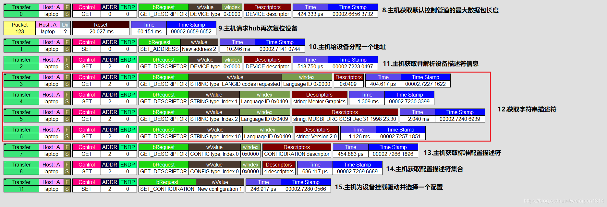

# USB枚举

USB设备的枚举过程如下：

1. USB设备插入USB接口后，主机检测D+/D-线上的电压，确认有设备连接，USB集线器通过中断IN通道，向主机报告有USB设备连接。

2. 主机接到通知后，通过集线器设备类请求GetPortStatus获取更多的信息。然后主机等待100ms等待设备稳定，然后发送集线器设备类请求SetPortStatus,对USB设备进行复位，复位后USB设备的地址为0，这样主机就可以使用地址0与USB设备进行通信,复位后的设备可以从USB总线上获取小于100mA的电流，用于使用**默认地址对管道0控制事务**响应。

3. 主机向地址为0（即刚插入的USB设备）的**设备端点0（默认端点）**发送**获取设备描述符的标准请求GetDescriptor**。

4. USB设备收到请求后，将其预设的**设备描述符返回给主机**。

5. 主机收到设备描述符后，**返回一个0长度的数据确认包**。

6. 主机对**设备再次复位**，复位后主机对地址为0的设备端点0发送一个设置地址SetAddress请求（新的设备地址在数据包中）。

7. 主机发送**请求状态返回**，设备返回0长度的状态数据包。

8. 主机收到状态数据包后，发送**应答包ACK给设备**，设备收到ACK后，启用新的设备地址。

9. 主机再次**使新的地址获取设备描述符GetDescriptor**，设备返回地址描述符。

10. 主机获取第一次配置描述符有前18个字节，**设备返回配置描述符的前18个字节**，其数据包中含有配置描述符的总长度。

11. 主机根据配置描述符的总长度再次获取配置描述符，**设备返回全总的配置描述符**。

12. 如果还有字符串描述符，系统还会获取字符串描述符。像HID设备还有报告描述符，它也需要单独获取。

