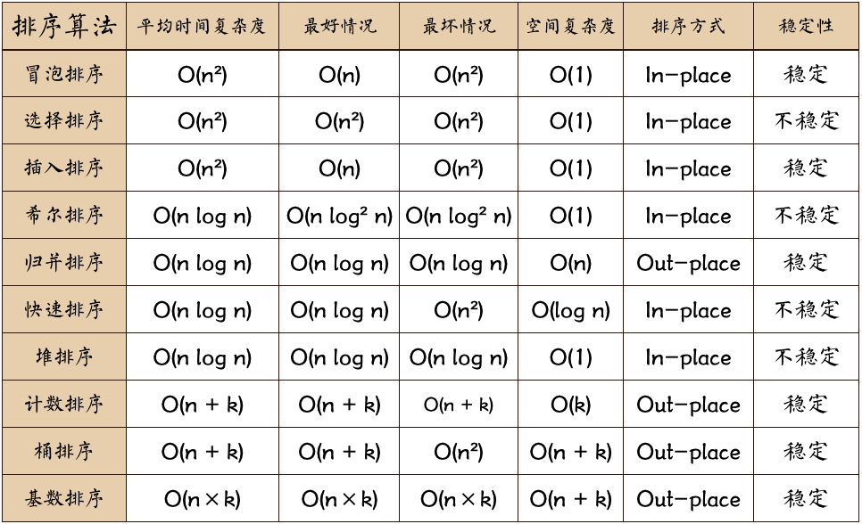

# 算法

[算法](https://www.hello-algo.com/chapter_hashing/hash_collision/#1)

[LeetCode](https://github.com/Shoukuan/leetcode)

三种主要的遍历思想为：**关键看根结点在哪，其他就是先左后右**

前序遍历（根结点在前）：根结点 ---> 左子树 ---> 右子树

中序遍历（根结点在中）：左子树---> 根结点 ---> 右子树

后序遍历（根结点在后）：左子树 ---> 右子树 ---> 根结点

**层次遍历**

queue<int> q; //以int型为例  
int x;  
q.empty()               如果队列为空返回true，否则返回false  
q.size()                返回队列中元素的个数  
q.pop()                 删除队列首元素但不返回其值  
q.front()               返回队首元素的值，但不删除该元素  
q.push(x)               在队尾压入新元素  
q.back()                返回队列尾元素的值，但不删除该元素  

## 排序算法

## 动态规划

[动态规划](https://www.cxyxiaowu.com/8536.html)

## 大小端

如：int 11223344
在存储的时候
大端：11 22 33 44
  0  1   2  3
  低地址----> 高地址

小端：44 33 22 11
  0  1   2  3
  低地址----> 高地址
大小端的差异在于存放顺序不同
