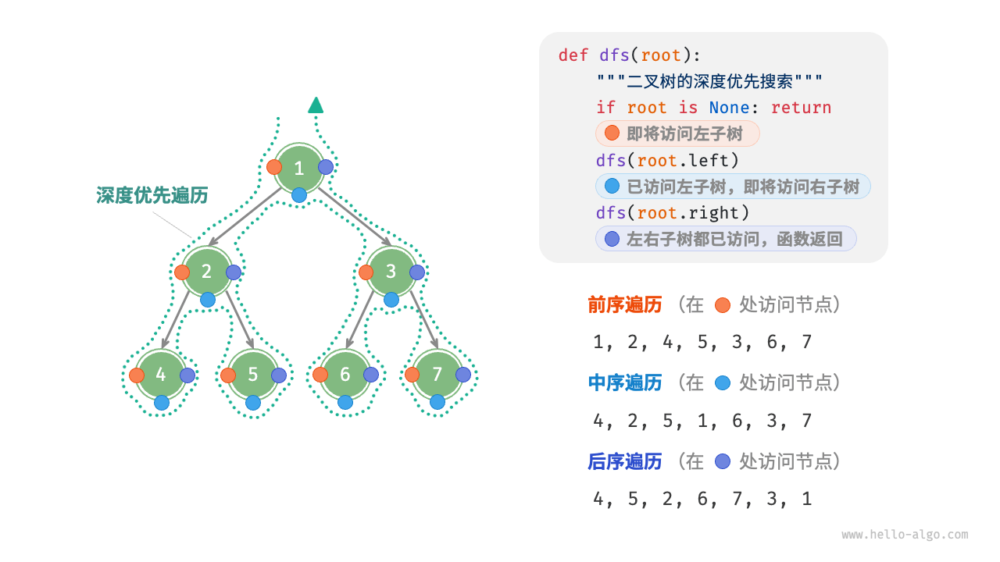

# 算法

[算法](https://www.hello-algo.com/chapter_hashing/hash_collision/#1)

[LeetCode](https://github.com/Shoukuan/leetcode)

三种主要的遍历思想为：**关键看根结点在哪，其他就是先左后右**

前序遍历（根结点在前）：根结点 ---> 左子树 ---> 右子树

中序遍历（根结点在中）：左子树---> 根结点 ---> 右子树

后序遍历（根结点在后）：左子树 ---> 右子树 ---> 根结点


**层次遍历**

queue<int> q; //以int型为例  
int x;  
q.empty()               如果队列为空返回true，否则返回false  
q.size()                返回队列中元素的个数  
q.pop()                 删除队列首元素但不返回其值  
q.front()               返回队首元素的值，但不删除该元素  
q.push(x)               在队尾压入新元素  
q.back()                返回队列尾元素的值，但不删除该元素  

## 排序算法


## 动态规划

[动态规划](https://www.cxyxiaowu.com/8536.html)

## 大小端

如：int 11223344
在存储的时候
大端：11 22 33 44
  0  1   2  3
  低地址----> 高地址

小端：44 33 22 11
  0  1   2  3
  低地址----> 高地址
大小端的差异在于存放顺序不同

## 动态规划

动态规划的常用术语:  

- 将数组 dp 称为 dp 表，表示状态dp[i]对应子问题的解。  
- 将最小子问题对应的状态（第1阶和第2阶楼梯）称为初始状态。  
- 将递推公式dp[i]=dp[i-1]+dp[i-2]称为状态转移方程。  

```C
/* 爬楼梯：动态规划 */
int climbingStairsDP(int n) {
    if (n == 1 || n == 2)
        return n;
    // 初始化 dp 表，用于存储子问题的解
    int *dp = (int *)malloc((n + 1) * sizeof(int));
    // 初始状态：预设最小子问题的解
    dp[1] = 1;
    dp[2] = 2;
    // 状态转移：从较小子问题逐步求解较大子问题
    for (int i = 3; i <= n; i++) {
        dp[i] = dp[i - 1] + dp[i - 2];
    }
    int result = dp[n];
    free(dp);
    return result;
}
```

**空间优化无须使用一个数组 dp 来存储所有子问题的解，两个变量滚动前进：**

```C
/* 爬楼梯：空间优化后的动态规划 */
int climbingStairsDPComp(int n) {
    if (n == 1 || n == 2)
        return n;
    // 变量初始值
    int a = 1, b = 2;
    // 变量滚动
    for (int i = 3; i <= n; i++) {
        int tmp = b;
        b = a + b;
        a = tmp;
    }
    return b;
}
```

### 二维动态规划

```C
/* 最小路径和：动态规划 */
int minPathSumDP(int grid[MAX_SIZE][MAX_SIZE], int n, int m) {
    // 初始化 dp 表
    int **dp = malloc(n * sizeof(int *));
    for (int i = 0; i < n; i++) {
        dp[i] = calloc(m, sizeof(int));
    }
    dp[0][0] = grid[0][0];
    // 状态转移：首行
    for (int j = 1; j < m; j++) {
        dp[0][j] = dp[0][j - 1] + grid[0][j];
    }
    // 状态转移：首列
    for (int i = 1; i < n; i++) {
        dp[i][0] = dp[i - 1][0] + grid[i][0];
    }
    // 状态转移：其余行和列
    for (int i = 1; i < n; i++) {
        for (int j = 1; j < m; j++) {
            dp[i][j] = myMin(dp[i][j - 1], dp[i - 1][j]) + grid[i][j];
        }
    }
    int res = dp[n - 1][m - 1];
    // 释放内存
    for (int i = 0; i < n; i++) {
        free(dp[i]);
    }
    return res;
}

```
